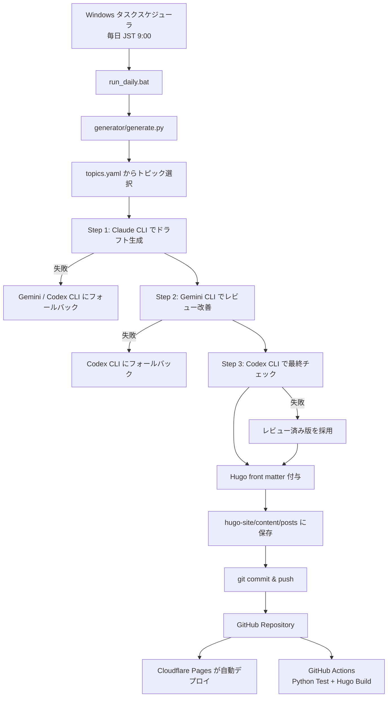

# AI × 不動産 自動ブログ

Hugo + PaperMod + Python CLI 自動生成 + GitHub + Cloudflare Pages で動く、日本語 AI ブログ自動運用システムです。

AI API は一切使いません。記事生成はローカル PC にインストール済みの `claude` / `gemini` / `codex` CLI を `subprocess` で呼び出すだけです。

---

## 1. 何が自動化されているか

- Hugo 静的ブログサイトの構成
- PaperMod テーマ前提の SEO / OGP / RSS / sitemap 設定
- 30日分以上のトピックローテーション
- Claude → Gemini → Codex の3段階記事生成・レビュー・最終チェック
- CLI 失敗時の自動フォールバック
- Hugo front matter の自動付与
- Markdown 記事の自動保存
- `git add` / `git commit` / `git push` の自動実行
- GitHub Actions による Python テスト、静的チェック、Hugo ビルド検証
- Cloudflare Pages 連携用の手順書
- Windows タスクスケジューラ登録手順

---

## 2. 全体アーキテクチャ



より詳しい設計は [`docs/architecture.md`](docs/architecture.md) を参照してください。

---

## 3. リポジトリ構成

```text
auto-ai-blog/
├── hugo-site/
│   ├── config.toml
│   ├── content/posts/
│   ├── static/
│   ├── themes/
│   ├── layouts/partials/extend_head.html
│   └── archetypes/default.md
├── generator/
│   ├── generate.py
│   ├── topics.yaml
│   ├── config.yaml
│   └── prompts.py
├── tests/
├── docs/
├── .github/workflows/daily-post.yml
├── run_daily.bat
├── requirements.txt
├── requirements-dev.txt
├── pyproject.toml
├── CODEX.md
└── README_ja.md
```

---

## 4. 初期セットアップ

### 4.1 リポジトリを配置する場所

指定されたローカル配置先:

```powershell
G:\マイドライブ\AI_Agents\github\repos\auto-ai-blog
```

ローカルで利用する場合は、GitHub からこの場所へ clone してください。

```powershell
cd G:\マイドライブ\AI_Agents\github\repos
git clone --recursive <YOUR_REPOSITORY_URL> auto-ai-blog
cd auto-ai-blog
```

`--recursive` を付け忘れた場合:

```powershell
git submodule update --init --recursive
```

このリポジトリには `.gitmodules` を入れています。GitHub Actions と Cloudflare Pages では PaperMod が存在しない場合に clone するフォールバックも入れてあります。

### 4.2 Hugo Extended をインストール

Windows:

```powershell
winget install Hugo.Hugo.Extended
```

確認:

```powershell
hugo version
```

Hugo は Linux ディストリビューション標準リポジトリだと最新でない場合があるため、本番ビルドでは GitHub Actions 側で Hugo Setup Action を使って Extended 版を入れます。Hugo 公式ドキュメントでも、配布リポジトリ版が最新とは限らない点が案内されています。

### 4.3 Python 依存関係

```powershell
cd G:\マイドライブ\AI_Agents\github\repos\auto-ai-blog
python -m venv .venv
.\.venv\Scripts\Activate.ps1
pip install -r requirements.txt
pip install -r requirements-dev.txt
```

### 4.4 AI CLI をインストール

このシステムは API キーを Python から直接呼びません。以下の CLI のうち、利用するものをローカル PC に入れてログインしておきます。

- Claude CLI: `claude -p "プロンプト"`
- Gemini CLI: `gemini -p "プロンプト"`
- Codex CLI: `codex -q "プロンプト"`

1つ失敗しても次の CLI にフォールバックします。

---

## 5. ローカル手動実行

```powershell
.\run_daily.bat
```

`run_daily.bat` の内容:

```bat
@echo off
set PYTHONIOENCODING=utf-8
cd /d G:\マイドライブ\AI_Agents\github\repos\auto-ai-blog
C:\Users\user\AppData\Local\Programs\Python\Python312\python.exe generator\generate.py
pause
```

Python の場所が違う場合は `run_daily.bat` の Python パスだけ変更してください。

---

## 6. Windows タスクスケジューラ登録

PowerShell を管理者または通常ユーザーで開き、以下を実行します。

```powershell
$action = New-ScheduledTaskAction -Execute "G:\マイドライブ\AI_Agents\github\repos\auto-ai-blog\run_daily.bat"
$trigger = New-ScheduledTaskTrigger -Daily -At 9:00am
Register-ScheduledTask -TaskName "auto-ai-blog" -Action $action -Trigger $trigger
```

登録確認:

```powershell
Get-ScheduledTask -TaskName "auto-ai-blog"
```

手動実行テスト:

```powershell
Start-ScheduledTask -TaskName "auto-ai-blog"
```

---

## 7. Cloudflare Pages 設定

Cloudflare Pages は手動設定が必要です。

推奨設定:

| 項目 | 値 |
|---|---|
| Framework preset | Hugo |
| Build command | `cd hugo-site && git submodule update --init --recursive || true; if [ ! -d themes/PaperMod ]; then git clone --depth=1 https://github.com/adityatelange/hugo-PaperMod.git themes/PaperMod; fi; hugo --gc --minify` |
| Build output directory | `hugo-site/public` |
| Root directory | 空欄、または repository root |
| Production branch | `main` |
| Environment variable | `HUGO_VERSION` を任意の固定バージョンに設定可能 |

Cloudflare Pages の詳しい画面操作は [`docs/setup.md`](docs/setup.md) を参照してください。

---

## 8. GitHub Actions の役割

`.github/workflows/daily-post.yml` は記事生成を行いません。

理由: GitHub Actions 上では Claude / Gemini / Codex CLI が利用できない、またはログイン状態を保持できない可能性が高いためです。

Actions で行うこと:

- Python 依存関係インストール
- Ruff による静的チェック
- pytest による単体テスト
- PaperMod テーマ取得
- Hugo ビルド検証
- `public/` を artifact として保存

スケジュールは JST 9:00、つまり UTC 0:00 です。

```yaml
cron: '0 0 * * *'
```

---

## 9. 記事生成フロー

### Step 1: ドラフト作成

Claude CLI を優先します。

```text
claude -p "プロンプト"
```

失敗時は Gemini、Codex の順にフォールバックします。

### Step 2: レビュー＆改善

Gemini CLI を優先します。

```text
gemini -p "プロンプト"
```

失敗時は Codex にフォールバックします。

### Step 3: 最終チェック

Codex CLI を優先します。

```text
codex -q "プロンプト"
```

失敗した場合は、レビュー済み版をそのまま採用します。

---

## 10. 生成記事の front matter

生成される Markdown は Hugo 用 YAML front matter を自動で持ちます。

```yaml
---
title: "記事タイトル"
date: 2026-06-22T09:00:00+09:00
draft: false
tags: ["AI", "不動産"]
categories: ["AI×不動産"]
description: "150字以内の meta description"
---
```

ファイル名:

```text
hugo-site/content/posts/YYYY-MM-DD-{slug}.md
```

---

## 11. 運用時に編集する主なファイル

| ファイル | 用途 |
|---|---|
| `generator/topics.yaml` | トピック、SEO キーワード、カテゴリを追加・編集 |
| `generator/config.yaml` | ブログ名、著者、文字数、CLI timeout、git 設定 |
| `generator/prompts.py` | AI CLI に渡すプロンプトテンプレート |
| `hugo-site/config.toml` | Hugo / PaperMod / SEO / OGP 設定 |
| `hugo-site/content/posts/` | 生成された記事 |

---

## 12. 本番運用に必要なもの

- GitHub リポジトリ
- Cloudflare Pages プロジェクト
- ローカル Windows PC
- Hugo Extended
- Python 3.12
- `pyyaml` / `python-slugify`
- Claude / Gemini / Codex CLI のいずれか1つ以上
- ローカル PC で `git push origin main` できる認証状態

Python から AI API を叩くための API キーは不要です。

---

## 13. テスト

```powershell
pytest
ruff check .
hugo --source hugo-site --gc --minify
```

PaperMod がない場合:

```powershell
git submodule update --init --recursive
```

または:

```powershell
git clone --depth=1 https://github.com/adityatelange/hugo-PaperMod.git hugo-site/themes/PaperMod
```

---

## 14. セキュリティ方針

- AI API は呼びません
- Python コードに API キーを保持しません
- `.env` は git 管理しません
- ローカル CLI のログイン情報は各 CLI の管理下に置きます
- Cloudflare / GitHub のトークン実値は README に書きません

---

## 15. レビュー結果

実装レビュー内容は [`docs/review.md`](docs/review.md) に記録しています。

主な確認ポイント:

- `generate.py` に OpenAI / Anthropic / Google API SDK 呼び出しがない
- AI 呼び出しは `subprocess.run()` のみ
- CLI フォールバック順をテストで確認
- Hugo front matter 生成をテストで確認
- GitHub Actions は記事生成ではなくビルド検証に限定
- Cloudflare Pages に必要な build command と output directory を明記
