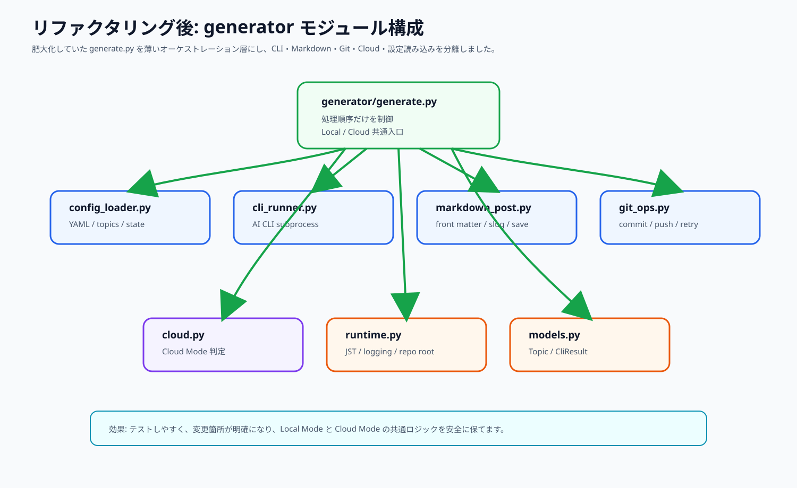

# AI × 不動産 自動ブログ

Hugo + PaperMod + Python CLI 自動生成 + GitHub + Cloudflare Pages で動く、日本語 AI ブログ自動運用システムです。

AI API は一切使いません。記事生成はローカル PC またはクラウド runner にインストール済みの `claude` / `gemini` / `codex` CLI を `subprocess` で呼び出すだけです。

---

## 画像で読む全体像

### 1. システム全体アーキテクチャ


ローカル Windows PC で記事生成を行い、GitHub に push し、Cloudflare Pages が自動デプロイする全体の流れです。記事生成はローカルPCで完結し、GitHub Actions は生成ではなく検証を担当します。

### 2. 毎朝9時のローカル自動実行


Windows タスクスケジューラが `run_daily.bat` を起動し、`generator/generate.py` を実行します。文字コードと作業ディレクトリをバッチで固定するため、日本語パスや日本語記事でも文字化けしにくい構成です。

### 3. generate.py の内部動作


`generate.py` は、設定読み込み、トピック選択、AI CLI 呼び出し、front matter 生成、記事保存、git commit & push までを担当します。Local Mode と Cloud Mode の両方から呼ばれる共通入口です。

### 4. Claude / Gemini / Codex のフォールバック


Claude が失敗したら Gemini、Gemini が失敗したら Codex、Codex が失敗した場合は直前の成果物を採用する設計です。全 CLI が失敗してドラフトすら作れない場合だけ、ログを残して記事生成をスキップします。

### 5. 各設定ファイルの役割


`topics.yaml` は記事テーマ、`config.yaml` は生成条件、`prompts.py` はAIへの指示、`config.toml` はHugo公開設定を担当します。プログラムを触らずに運用調整しやすい構成です。

### 6. git push から Cloudflare Pages 公開まで


生成した記事は `git add`、`git commit`、`git push origin main` で GitHub へ送られます。Cloudflare Pages は GitHub の更新を検知し、Hugo をビルドして CDN へ公開します。

### 7. Hugo build の中身


Hugo は `content/posts`、`config.toml`、`themes/PaperMod`、`static` を読み込み、`hugo-site/public` を生成します。Cloudflare Pages ではこの `public` ディレクトリを配信します。

### 8. エラー処理とログ


CLI 失敗、レビュー失敗、最終チェック失敗、git push 失敗のそれぞれで、安全に継続または停止する設計です。ログは `generator/logs/generate.log` に残します。

### 9. 各プログラムの責務


どのファイルが何を担当するかを一覧化しています。通常運用で触るのは `topics.yaml`、`config.yaml`、`hugo-site/config.toml` が中心です。

### 10. 初期設定と運用チェックリスト


初回セットアップ、手動実行テスト、タスクスケジューラ登録、Cloudflare Pages 接続、本番運用の順番を図にしています。

---

## Cloud Mode: クラウド側でも全部実行

### 11. Local Mode + Cloud Mode の二系統構成


Local Mode は Windows PC から、Cloud Mode は GitHub Actions / クラウドVM / self-hosted runner から実行します。どちらも最終的には同じ `generator/generate.py` を呼ぶため、記事生成ロジックは二重管理になりません。

### 12. GitHub Actions での記事生成・ビルド・push


Cloud Mode workflow は、checkout、Python/Node セットアップ、AI CLI 準備、記事生成、commit & push、Hugo build、artifact upload まで実行します。テンプレートは `docs/workflows/cloud-daily-post.yml` にあります。

### 13. Cloud Secrets と AI CLI 認証


GitHub Secrets は runner の環境変数として CLI プロセスに渡されます。Python は Secret 値を使って AI API を直接呼びません。CLI の認証方式に合わせて `CLOUD_AI_CLI_INSTALL_COMMANDS` や CLI 用 Secret を設定します。

### 14. Cloudflare Pages Deploy Hook 併用


通常は GitHub push を Cloudflare Pages が検知します。より明示的にデプロイを起動したい場合だけ、`CLOUDFLARE_PAGES_DEPLOY_HOOK_URL` を GitHub Secrets に保存し、workflow 末尾で Deploy Hook を呼びます。

### 15. GitHub Actions 以外のクラウドVM / self-hosted runner


GitHub Actions に限定せず、任意のクラウドVMや self-hosted runner でも `scripts/cloud_prepare_ai_cli.sh` と `scripts/cloud_generate.sh` を使って同じ Cloud Mode を実行できます。

---

## リファクタリング後の generator 構成

### 16. generator モジュール分割



`generator/generate.py` は薄いオーケストレーション層にし、設定読み込み、CLI実行、Markdown生成、git操作、Cloud Mode判定、runtime補助をモジュール分割しました。これにより、テストしやすく、変更箇所が追いやすくなっています。

| ファイル | 責務 |
|---|---|
| `generator/generate.py` | 全体処理の順番を制御する入口。Local Mode / Cloud Mode 共通。 |
| `generator/models.py` | `Topic`、`CliResult` の共有データ構造。 |
| `generator/config_loader.py` | `config.yaml`、`topics.yaml`、`.state.json` の読み書き。 |
| `generator/cli_runner.py` | `claude`、`gemini`、`codex` の `subprocess` 実行とフォールバック。 |
| `generator/markdown_post.py` | title抽出、slug生成、front matter生成、記事保存。 |
| `generator/git_ops.py` | git add / commit / push、push branch 解決、push retry。 |
| `generator/cloud.py` | Cloud Mode 判定、クラウド実行時の git identity 設定。 |
| `generator/runtime.py` | JST timezone、repo root、logging setup。 |

詳細は [`docs/refactoring.md`](docs/refactoring.md) にまとめています。

---

## 実行モード比較

| 項目 | Local Mode | Cloud Mode |
|---|---|---|
| 実行場所 | Windows PC | GitHub Actions / Cloud VM / self-hosted runner |
| 起動方法 | Windows タスクスケジューラ | cron / workflow_dispatch / systemd timer |
| AI CLI | ローカルPCにインストール | runner上でインストール |
| 認証 | ローカルCLIのログイン状態 | GitHub Secrets / runner secrets |
| 生成コマンド | `python generator/generate.py` | `python generator/generate.py --cloud` |
| commit & push | ローカル git 認証 | `GITHUB_TOKEN` または runner の git 認証 |
| Cloudflare公開 | GitHub push 検知 | GitHub push 検知 + 任意で Deploy Hook |

---

## Cloud Mode で追加されたファイル

| ファイル | 役割 |
|---|---|
| `scripts/cloud_prepare_ai_cli.sh` | クラウド runner 上で AI CLI のインストール確認と任意のインストールコマンド実行を行います。 |
| `scripts/cloud_generate.sh` | `BLOG_EXECUTION_MODE=cloud`、git author、push branch を設定し、`generate.py --cloud` を実行します。 |
| `docs/workflows/cloud-daily-post.yml` | GitHub Actions 用 Cloud Mode workflow テンプレートです。 |
| `docs/cloud-mode.md` | Cloud Mode の詳しい設定・運用説明です。 |
| `tests/test_cloud_mode.py` | Cloud Mode の環境判定と push branch 判定をテストします。 |

---

## プログラム別の動き

| ファイル | 役割 |
|---|---|
| `run_daily.bat` | Windows から Python を起動する入口。文字コードと作業ディレクトリを固定します。 |
| `scripts/cloud_prepare_ai_cli.sh` | クラウド側で AI CLI の準備状態を確認します。 |
| `scripts/cloud_generate.sh` | クラウド側で `generate.py --cloud` を実行します。 |
| `generator/generate.py` | 記事生成の流れをまとめる入口です。 |
| `generator/cli_runner.py` | AI CLI 呼び出しとフォールバックを担当します。 |
| `generator/markdown_post.py` | Markdown記事と front matter 生成を担当します。 |
| `generator/git_ops.py` | git commit / push を担当します。 |
| `generator/prompts.py` | Claude / Gemini / Codex に渡すプロンプトを生成します。 |
| `generator/topics.yaml` | 1ヶ月分以上のトピック、SEOキーワード、カテゴリを管理します。 |
| `generator/config.yaml` | 文字数、CLI timeout、優先順位、git commit設定を管理します。 |
| `hugo-site/config.toml` | Hugo、PaperMod、日本語、SEO、RSS、sitemap、OGPを設定します。 |
| `hugo-site/content/posts/` | 生成された Markdown 記事が保存されます。 |
| `docs/daily-post.yml` | ローカル生成前提のビルド検証 workflow テンプレートです。 |
| `docs/workflows/cloud-daily-post.yml` | クラウド生成込みの workflow テンプレートです。 |

さらに詳しい図解一覧は [`docs/program-flow.md`](docs/program-flow.md) にまとめています。Cloud Mode の詳細は [`docs/cloud-mode.md`](docs/cloud-mode.md) を参照してください。

---

## ディレクトリ構成

```text
auto-ai-blog/
├── hugo-site/
├── generator/
│   ├── generate.py
│   ├── models.py
│   ├── config_loader.py
│   ├── cli_runner.py
│   ├── markdown_post.py
│   ├── git_ops.py
│   ├── cloud.py
│   ├── runtime.py
│   ├── prompts.py
│   ├── topics.yaml
│   └── config.yaml
├── scripts/
│   ├── cloud_prepare_ai_cli.sh
│   ├── cloud_generate.sh
│   └── register_task.ps1
├── tests/
├── docs/
│   ├── images/
│   ├── workflows/
│   │   └── cloud-daily-post.yml
│   ├── architecture.md
│   ├── cloud-mode.md
│   ├── program-flow.md
│   ├── refactoring.md
│   ├── setup.md
│   ├── review.md
│   └── daily-post.yml
├── run_daily.bat
├── requirements.txt
├── requirements-dev.txt
├── CODEX.md
└── README_ja.md
```

---

## セットアップ

### 1. ローカル配置先

```powershell
G:\マイドライブ\AI_Agents\github\repos\auto-ai-blog
```

```powershell
cd G:\マイドライブ\AI_Agents\github\repos
git clone --recursive <YOUR_REPOSITORY_URL> auto-ai-blog
cd auto-ai-blog
```

`--recursive` を付け忘れた場合:

```powershell
git submodule update --init --recursive
```

PaperMod が取得できない場合:

```powershell
git clone --depth=1 https://github.com/adityatelange/hugo-PaperMod.git hugo-site/themes/PaperMod
```

### 2. Hugo Extended

```powershell
winget install Hugo.Hugo.Extended
hugo version
```

### 3. Python

```powershell
python -m venv .venv
.\.venv\Scripts\Activate.ps1
pip install -r requirements.txt
pip install -r requirements-dev.txt
```

### 4. AI CLI

Python から AI API は叩きません。以下の CLI のうち、使うものをローカル PC またはクラウド runner に入れてログイン・認証しておきます。

```powershell
claude -p "テスト"
gemini -p "テスト"
codex -q "テスト"
```

### 5. Local Mode 手動実行

```powershell
.\run_daily.bat
```

### 6. Cloud Mode 手動実行

```bash
export BLOG_EXECUTION_MODE=cloud
bash scripts/cloud_prepare_ai_cli.sh
bash scripts/cloud_generate.sh
```

### 7. Windows タスクスケジューラ登録

```powershell
$action = New-ScheduledTaskAction -Execute "G:\マイドライブ\AI_Agents\github\repos\auto-ai-blog\run_daily.bat"
$trigger = New-ScheduledTaskTrigger -Daily -At 9:00am
Register-ScheduledTask -TaskName "auto-ai-blog" -Action $action -Trigger $trigger
```

---

## Cloudflare Pages 設定

| 項目 | 値 |
|---|---|
| Framework preset | Hugo |
| Build command | `cd hugo-site && git submodule update --init --recursive || true; if [ ! -d themes/PaperMod ]; then git clone --depth=1 https://github.com/adityatelange/hugo-PaperMod.git themes/PaperMod; fi; hugo --gc --minify` |
| Build output directory | `hugo-site/public` |
| Root directory | 空欄、または repository root |
| Production branch | `main` |

Cloudflare Pages の詳しい画面操作は [`docs/setup.md`](docs/setup.md) を参照してください。

---

## GitHub Actions の役割

ローカル生成だけで運用する場合、Actions はビルド検証だけを担当します。Cloud Mode を使う場合、Actions が記事生成、commit & push、Hugo build まで担当できます。

Workflow テンプレート:

- ビルド検証のみ: `docs/daily-post.yml`
- クラウド生成込み: `docs/workflows/cloud-daily-post.yml`

---

## 生成記事の front matter

```yaml
---
title: "記事タイトル"
date: 2026-06-22T09:00:00+09:00
draft: false
tags:
  - "AI"
  - "不動産"
categories:
  - "AI×不動産"
description: "150字以内の meta description"
---
```

ファイル名:

```text
hugo-site/content/posts/YYYY-MM-DD-{slug}.md
```

---

## 本番運用に必要なもの

- GitHub リポジトリ
- Cloudflare Pages プロジェクト
- ローカル Windows PC またはクラウド runner
- Hugo Extended
- Python 3.12
- Claude / Gemini / Codex CLI のいずれか1つ以上
- git push できる認証状態
- Cloud Mode の場合は必要な GitHub Secrets

API キーを Python へ渡して API を直接呼ぶ必要はありません。

---

## 詳細ドキュメント

- [`docs/architecture.md`](docs/architecture.md): アーキテクチャ詳細
- [`docs/cloud-mode.md`](docs/cloud-mode.md): Cloud Mode 設定・運用
- [`docs/program-flow.md`](docs/program-flow.md): プログラム別の画像解説
- [`docs/refactoring.md`](docs/refactoring.md): リファクタリング記録
- [`docs/setup.md`](docs/setup.md): セットアップ手順
- [`docs/review.md`](docs/review.md): 実装レビュー
- [`docs/daily-post.yml`](docs/daily-post.yml): ビルド検証 workflow テンプレート
- [`docs/workflows/cloud-daily-post.yml`](docs/workflows/cloud-daily-post.yml): Cloud Mode workflow テンプレート
