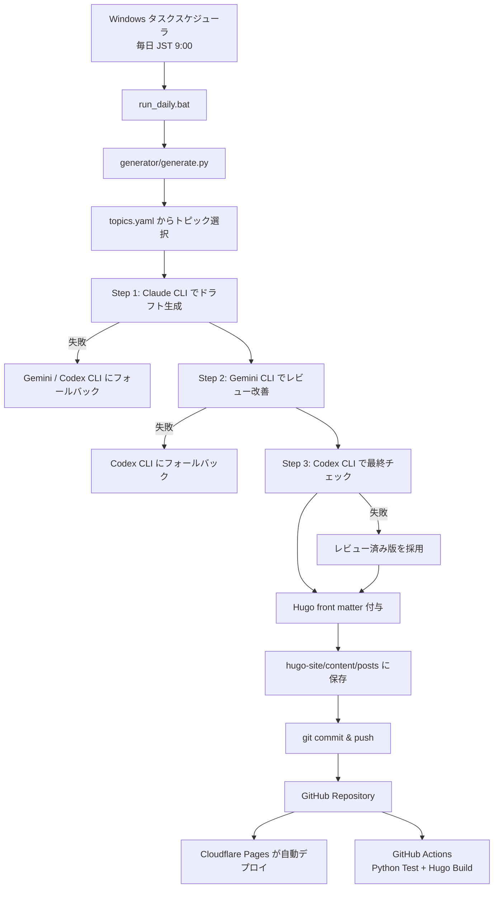

# AI × 不動産 自動ブログ

Hugo + PaperMod + Python CLI 自動生成 + GitHub + Cloudflare Pages で動く、日本語 AI ブログ自動運用システムです。

AI API は一切使いません。記事生成はローカル PC にインストール済みの `claude` / `gemini` / `codex` CLI を `subprocess` で呼び出すだけです。

## 全体アーキテクチャ



詳細は [`docs/architecture.md`](docs/architecture.md) を参照してください。

## できること

- Hugo 静的ブログサイトの構成
- PaperMod テーマ前提の SEO / OGP / RSS / sitemap 設定
- 30日分以上のトピックローテーション
- Claude → Gemini → Codex の3段階記事生成・レビュー・最終チェック
- CLI 失敗時の自動フォールバック
- Hugo front matter の自動付与
- Markdown 記事の自動保存
- `git add` / `git commit` / `git push` の自動実行
- GitHub Actions による Python テスト、静的チェック、Hugo ビルド検証
- Cloudflare Pages 連携用手順
- Windows タスクスケジューラ登録手順

## ローカル配置先

```powershell
G:\マイドライブ\AI_Agents\github\repos\auto-ai-blog
```

```powershell
cd G:\マイドライブ\AI_Agents\github\repos
git clone --recursive <YOUR_REPOSITORY_URL> auto-ai-blog
cd auto-ai-blog
```

`--recursive` を付け忘れた場合:

```powershell
git submodule update --init --recursive
```

このリポジトリには `.gitmodules` を入れています。GitHub Actions と Cloudflare Pages では PaperMod が存在しない場合に clone するフォールバックも入れています。

## Hugo Extended

```powershell
winget install Hugo.Hugo.Extended
hugo version
```

## Python

```powershell
python -m venv .venv
.\.venv\Scripts\Activate.ps1
pip install -r requirements.txt
pip install -r requirements-dev.txt
```

## AI CLI

Python から AI API は叩きません。以下の CLI のうち、使うものをローカル PC に入れてログインしておきます。

```powershell
claude -p "テスト"
gemini -p "テスト"
codex -q "テスト"
```

## 手動実行

```powershell
.\run_daily.bat
```

## Windows タスクスケジューラ登録

```powershell
$action = New-ScheduledTaskAction -Execute "G:\マイドライブ\AI_Agents\github\repos\auto-ai-blog\run_daily.bat"
$trigger = New-ScheduledTaskTrigger -Daily -At 9:00am
Register-ScheduledTask -TaskName "auto-ai-blog" -Action $action -Trigger $trigger
```

## Cloudflare Pages 設定

| 項目 | 値 |
|---|---|
| Framework preset | Hugo |
| Build command | `cd hugo-site && git submodule update --init --recursive || true; if [ ! -d themes/PaperMod ]; then git clone --depth=1 https://github.com/adityatelange/hugo-PaperMod.git themes/PaperMod; fi; hugo --gc --minify` |
| Build output directory | `hugo-site/public` |
| Root directory | 空欄、または repository root |
| Production branch | `main` |

Cloudflare Pages の詳しい画面操作は [`docs/setup.md`](docs/setup.md) を参照してください。

## GitHub Actions の役割

`.github/workflows/daily-post.yml` は記事生成を行いません。GitHub Actions 上では Claude / Gemini / Codex CLI が利用できない、またはログイン状態を保持できない可能性が高いためです。

Actions は以下だけを実行します。

- `ruff check .`
- `pytest`
- PaperMod テーマ取得
- Hugo ビルド検証
- `hugo-site/public` artifact upload

スケジュールは JST 9:00、つまり UTC 0:00 です。

```yaml
cron: '0 0 * * *'
```

## 生成記事の front matter

```yaml
---
title: "記事タイトル"
date: 2026-06-22T09:00:00+09:00
draft: false
tags: ["AI", "不動産"]
categories: ["AI×不動産"]
description: "150字以内の meta description"
---
```

ファイル名:

```text
hugo-site/content/posts/YYYY-MM-DD-{slug}.md
```

## 本番運用に必要なもの

- GitHub リポジトリ
- Cloudflare Pages プロジェクト
- ローカル Windows PC
- Hugo Extended
- Python 3.12
- Claude / Gemini / Codex CLI のいずれか1つ以上
- ローカル PC で `git push origin main` できる認証状態

API キーを Python へ渡す必要はありません。

## レビュー

実装レビュー内容は [`docs/review.md`](docs/review.md) に記録しています。
