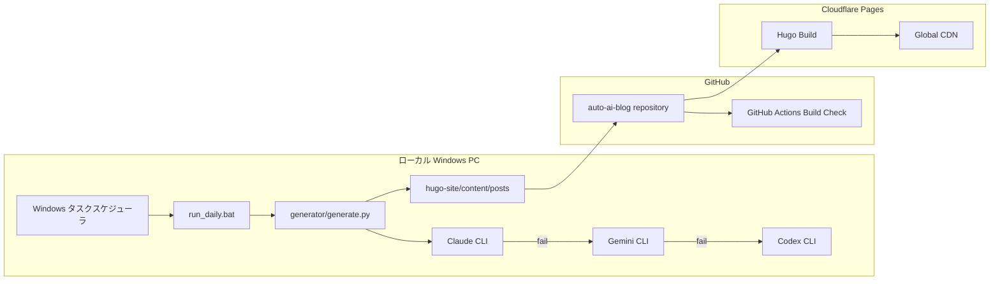
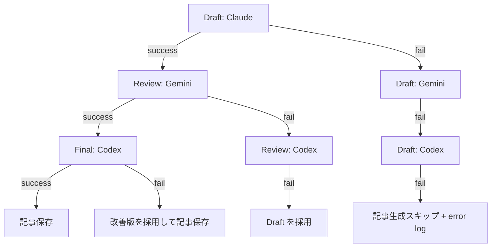

# アーキテクチャ詳細

このシステムは、ローカル PC 上の AI CLI を使って日本語ブログ記事を自動生成し、Hugo 静的サイトとして Cloudflare Pages へ自動デプロイする構成です。

AI API は使用しません。Python からは `subprocess` で CLI を起動するだけです。



## 処理フロー

1. Windows タスクスケジューラが毎朝 9:00 に `run_daily.bat` を起動します。
2. `generator/generate.py` が `topics.yaml` から次のトピックを選択します。
3. Claude CLI でドラフトを生成します。
4. Claude が失敗したら Gemini、さらに失敗したら Codex にフォールバックします。
5. Gemini CLI でレビューと改善を行います。
6. Gemini が失敗したら Codex にフォールバックします。
7. Codex CLI で最終チェックします。
8. Codex が失敗した場合はレビュー済み版を採用します。
9. Hugo front matter を付与して Markdown を保存します。
10. `git add`、`git commit`、`git push` を実行します。
11. Cloudflare Pages が GitHub の変更を検知して自動デプロイします。

## フォールバック設計



## GitHub Actions

GitHub Actions は記事生成を行いません。Python lint、unit test、Hugo build、artifact upload だけを担当します。

Workflow 本体のテンプレートは `docs/daily-post.yml` にあります。

## Cloudflare Pages

推奨 build command:

```bash
cd hugo-site && git submodule update --init --recursive || true; if [ ! -d themes/PaperMod ]; then git clone --depth=1 https://github.com/adityatelange/hugo-PaperMod.git themes/PaperMod; fi; hugo --gc --minify
```

Output directory:

```text
hugo-site/public
```
