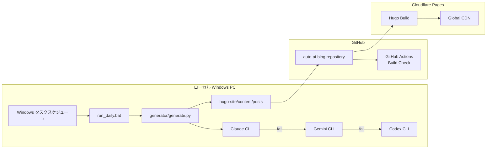
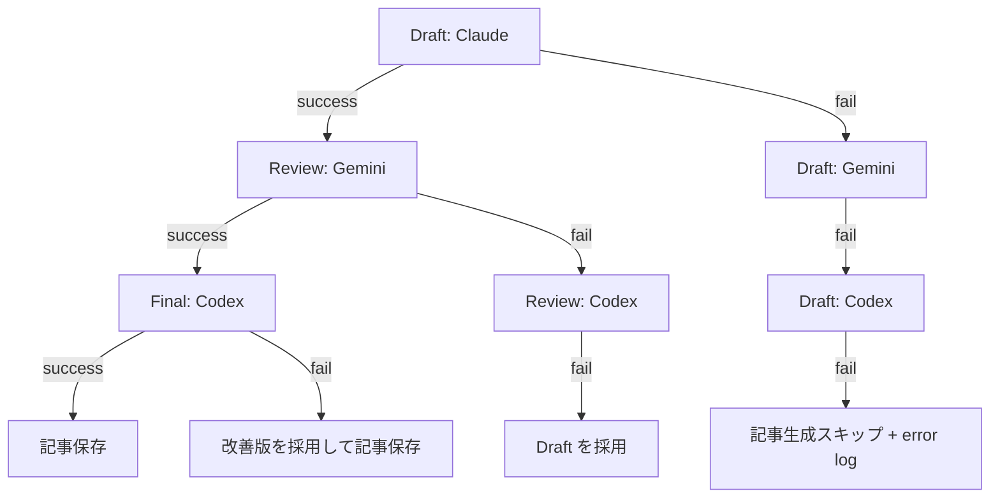

# アーキテクチャ詳細

## 目的

このシステムは、ローカル PC 上の AI CLI を使って日本語ブログ記事を自動生成し、Hugo 静的サイトとして Cloudflare Pages へ自動デプロイするための構成です。

AI API は使用しません。Python からは `subprocess` で CLI を起動するだけです。

## 全体像



## 処理フロー

1. Windows タスクスケジューラが毎朝 9:00 に `run_daily.bat` を起動します。
2. `run_daily.bat` が `generator/generate.py` を実行します。
3. `topics.yaml` から次のトピックを選択します。
4. Claude CLI でドラフトを生成します。
5. Claude が失敗したら Gemini、さらに失敗したら Codex にフォールバックします。
6. Gemini CLI でレビューと改善を行います。
7. Gemini が失敗したら Codex にフォールバックします。
8. Codex CLI で最終チェックします。
9. Codex が失敗した場合はレビュー済み版を採用します。
10. Hugo front matter を付与して Markdown を保存します。
11. `git add`、`git commit`、`git push` を実行します。
12. Cloudflare Pages が GitHub の変更を検知して自動デプロイします。

## ディレクトリ別責務

| ディレクトリ | 責務 |
|---|---|
| `hugo-site/` | Hugo サイト本体 |
| `hugo-site/content/posts/` | 生成記事 Markdown |
| `generator/` | 記事生成、CLI 呼び出し、git push |
| `.github/workflows/` | CI と Hugo ビルド検証 |
| `docs/` | 設計、セットアップ、レビュー記録 |

## AI CLI 呼び出し設計

`generator/generate.py` は次のコマンド形式だけを使います。

```text
claude -p "プロンプト"
gemini -p "プロンプト"
codex -q "プロンプト"
```

Python ライブラリとして OpenAI、Anthropic、Google Generative AI SDK などは導入していません。

## フォールバック設計



## GitHub Actions

GitHub Actions は記事生成を行いません。CI の責務は以下です。

- Python lint
- Python unit test
- Hugo Extended setup
- PaperMod テーマ取得
- Hugo build
- `hugo-site/public` artifact upload

## Cloudflare Pages

Cloudflare Pages は GitHub repository の `main` ブランチを監視します。

推奨 build command:

```bash
cd hugo-site && git submodule update --init --recursive || true; if [ ! -d themes/PaperMod ]; then git clone --depth=1 https://github.com/adityatelange/hugo-PaperMod.git themes/PaperMod; fi; hugo --gc --minify
```

Output directory:

```text
hugo-site/public
```

## 本番運用で必要なもの

- GitHub リポジトリ
- Cloudflare Pages プロジェクト
- ローカル Windows PC
- Python 3.12
- Hugo Extended
- AI CLI のログイン状態
- Git push 可能な認証状態

## 今後の拡張案

- 投稿前の禁止語チェック
- 生成記事の類似度チェック
- 画像生成 CLI との連携
- Search Console 用 sitemap ping
- Cloudflare Pages デプロイ成功通知
- 投稿カテゴリごとの曜日ローテーション
