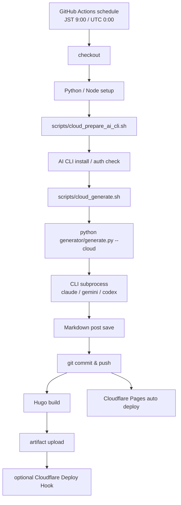

# Cloud Mode: クラウド側でも記事生成する設計

このリポジトリは、ローカル Windows PC だけでなく、GitHub Actions や任意のクラウド runner でも記事生成できる Cloud Mode を持ちます。

重要な制約は Local Mode と同じです。

- Python から AI API を直接呼びません。
- AI SDK を追加しません。
- `claude -p`、`gemini -p`、`codex -q` のような CLI コマンドだけを `subprocess` で呼びます。

## 1. Local Mode と Cloud Mode の違い

| 項目 | Local Mode | Cloud Mode |
|---|---|---|
| 実行場所 | Windows PC | GitHub Actions / self-hosted runner / VM |
| 起動方法 | Windows タスクスケジューラ | cron schedule / workflow_dispatch |
| AI CLI | ローカルPCにインストール | runner上にインストール |
| 認証 | ローカルCLIのログイン状態 | GitHub Secrets / runner secrets |
| commit & push | ローカルgit認証 | `GITHUB_TOKEN` または runner のgit認証 |
| Cloudflare deploy | GitHub push を検知 | GitHub push または Deploy Hook |

## 2. 追加されたファイル

| ファイル | 役割 |
|---|---|
| `scripts/cloud_prepare_ai_cli.sh` | クラウドrunner上で AI CLI のインストール確認と任意のインストールコマンド実行 |
| `scripts/cloud_generate.sh` | Cloud Mode 用の環境変数と git author を設定し、`generate.py --cloud` を実行 |
| `docs/workflows/cloud-daily-post.yml` | GitHub Actions 用の Cloud Mode workflow テンプレート |
| `docs/cloud-mode.md` | Cloud Mode の説明 |

## 3. Cloud Mode の処理フロー



## 4. GitHub Actions に置く workflow

この環境では `.github/workflows/*.yml` への直接書き込みが GitHub API 側で `404 Not Found` になるため、workflow 本体は以下に保存しています。

```text

docs/workflows/cloud-daily-post.yml
```

GitHub 側で workflow 書き込み権限がある環境では、同じ内容を次へ配置します。

```text
.github/workflows/cloud-daily-post.yml
```

## 5. GitHub Secrets

Cloud Mode では、CLI を runner にインストールし、CLI が使う認証情報を Secrets に置きます。

推奨 Secrets:

| Secret | 用途 |
|---|---|
| `CLOUD_AI_CLI_INSTALL_COMMANDS` | AI CLI をインストールする shell コマンド。例: npm install など。 |
| `CLOUDFLARE_PAGES_DEPLOY_HOOK_URL` | 任意。Cloudflare Pages Deploy Hook URL。 |
| `CLAUDE_CONFIG` | 任意。Claude CLI 用の設定を渡す場合の枠。 |
| `GEMINI_API_KEY` | 任意。Gemini CLI が環境変数を読む運用の場合の枠。Pythonから直接APIは呼びません。 |
| `CODEX_AUTH_JSON` | 任意。Codex CLI 用の認証設定を渡す場合の枠。 |

実際にどの Secret が必要かは、使う CLI の認証方式に依存します。Python コードはこれらを読んで AI API を呼び出すことはありません。CLI プロセスに環境変数として渡されるだけです。

## 6. Cloudflare Pages Deploy Hook

Cloudflare Pages が GitHub 連携で自動デプロイできる場合、通常は push だけで十分です。より確実にクラウド生成後のデプロイを起動したい場合は、Cloudflare Pages の Deploy Hook URL を `CLOUDFLARE_PAGES_DEPLOY_HOOK_URL` に保存します。

workflow 末尾で以下を実行します。

```bash
curl -fsS -X POST "$CLOUDFLARE_PAGES_DEPLOY_HOOK_URL"
```

## 7. 任意のクラウドVM / self-hosted runner で実行する場合

GitHub Actions ではなく、クラウドVMでも同じスクリプトを使えます。

```bash
git clone --recursive <YOUR_REPOSITORY_URL> auto-ai-blog
cd auto-ai-blog
python -m venv .venv
source .venv/bin/activate
pip install -r requirements.txt -r requirements-dev.txt
export BLOG_EXECUTION_MODE=cloud
bash scripts/cloud_prepare_ai_cli.sh
bash scripts/cloud_generate.sh
```

## 8. Cloud Mode の安全設計

- API SDK を入れません。
- AI API endpoint へ HTTP リクエストしません。
- CLI が1つも使えない場合は記事生成をスキップします。
- commit & push は記事生成に成功した場合だけ実行します。
- push は最大3回リトライします。
- `generator/.state.json` に Local / Cloud の実行modeを記録します。
