# プログラム別フロー解説

README に掲載している図を、プログラム単位でさらに追いやすく整理したページです。

## 1. 全体アーキテクチャ

## 2. ローカル毎日実行

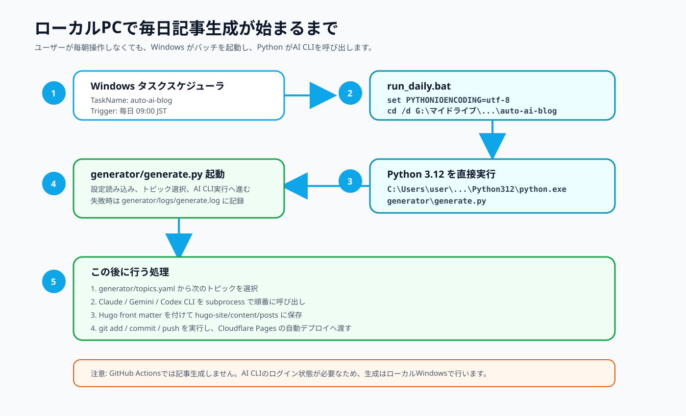

## 3. generate.py 内部処理

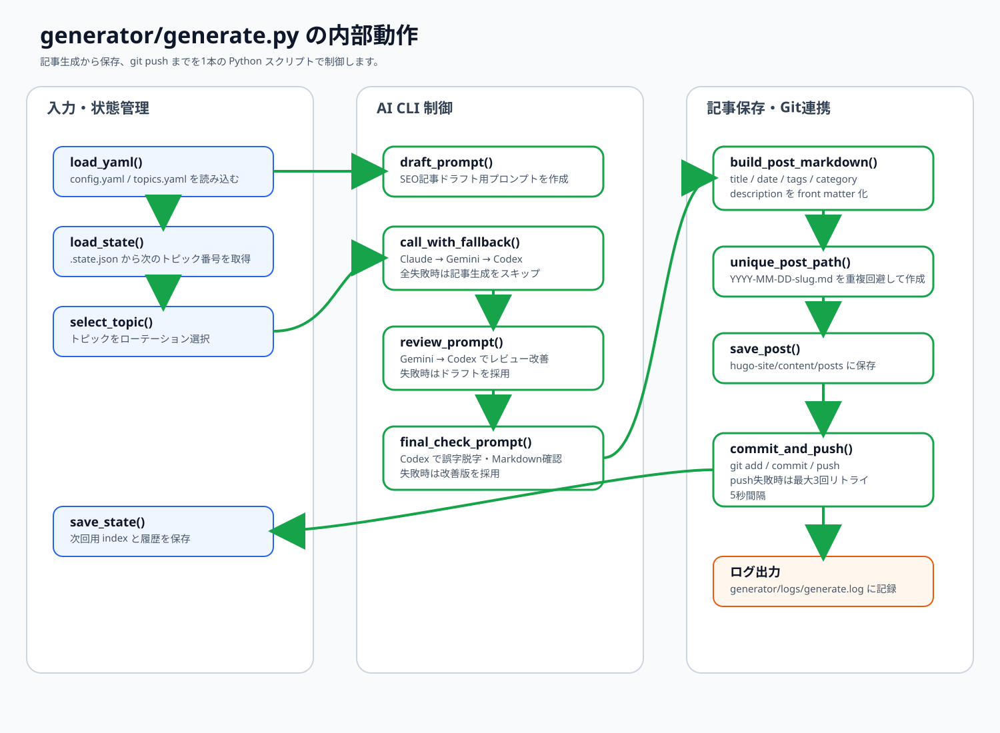

## 4. AI CLI フォールバック

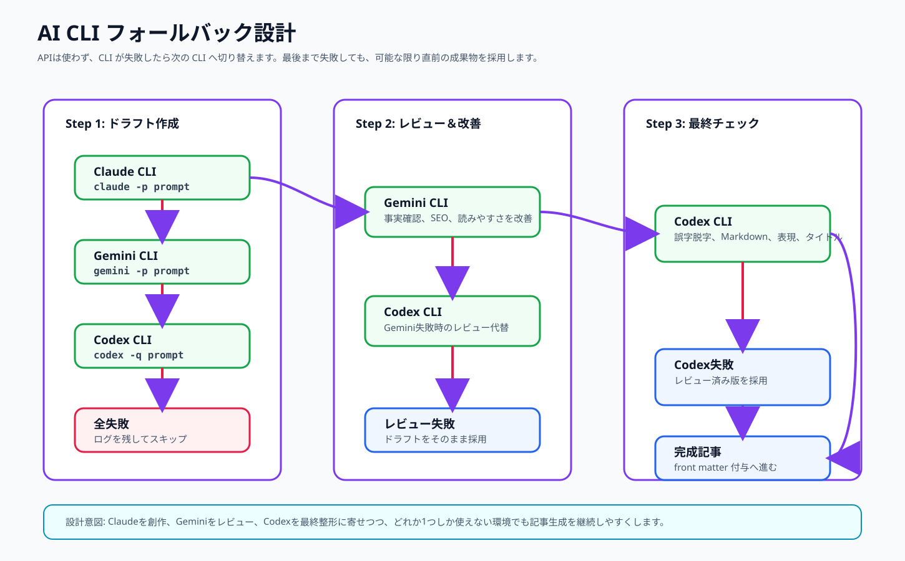

## 5. 設定ファイルの関係

## 6. git push と Cloudflare Pages

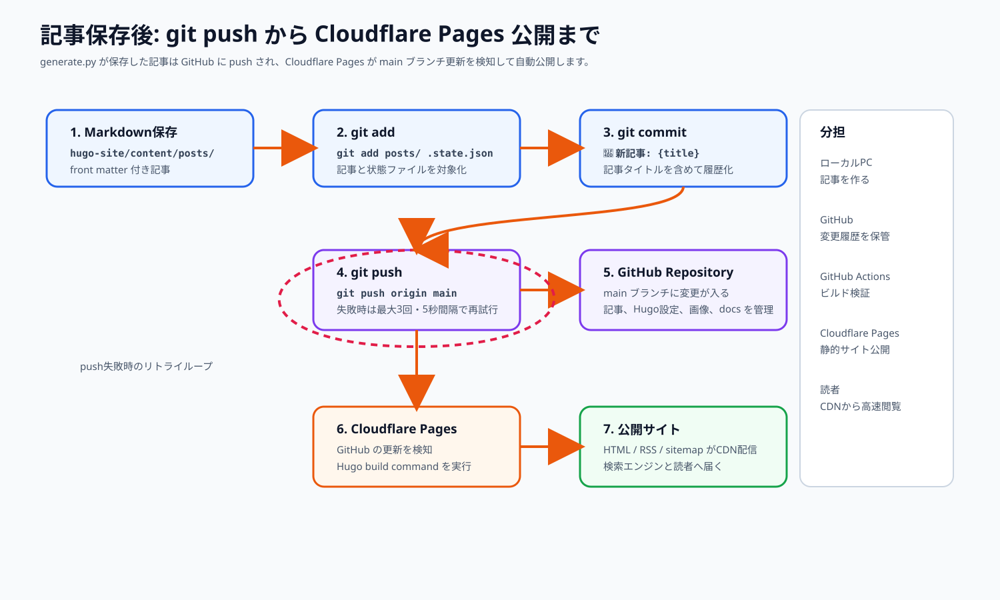

## 7. Hugo build

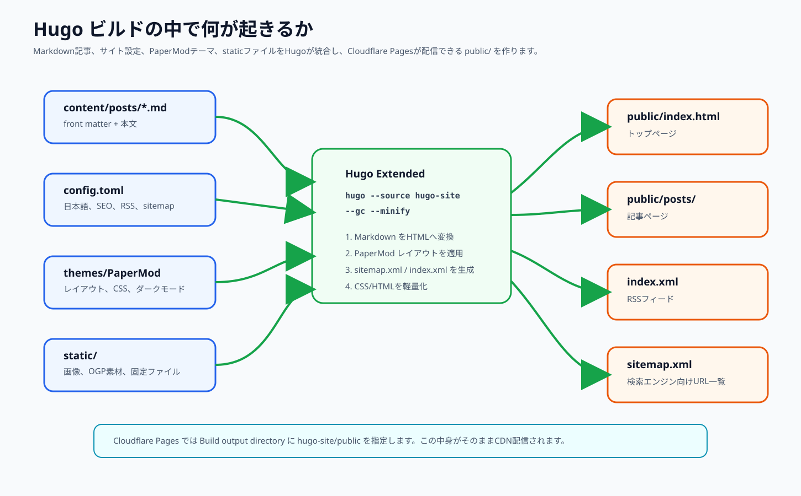

## 8. エラー処理とログ

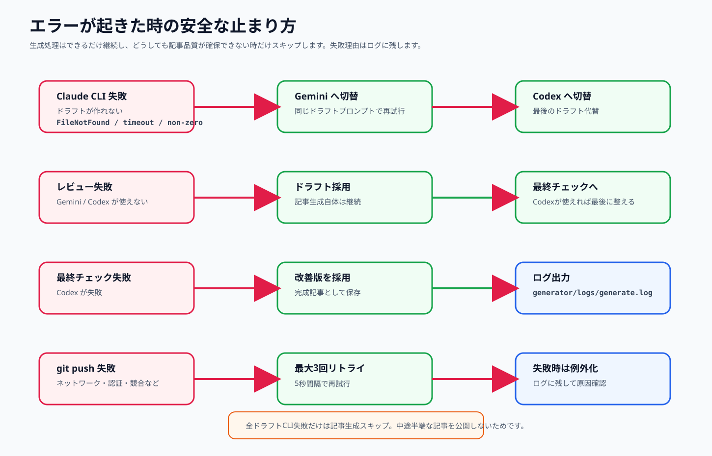

## 9. 各プログラムの責務

## 10. 初期設定と運用

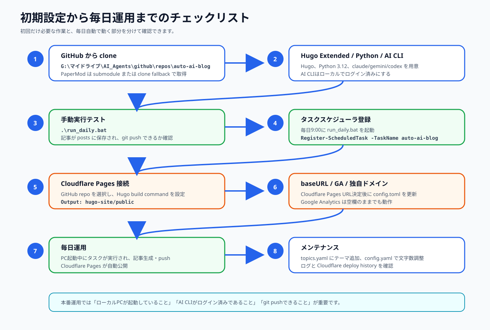

## 11. Local Mode + Cloud Mode

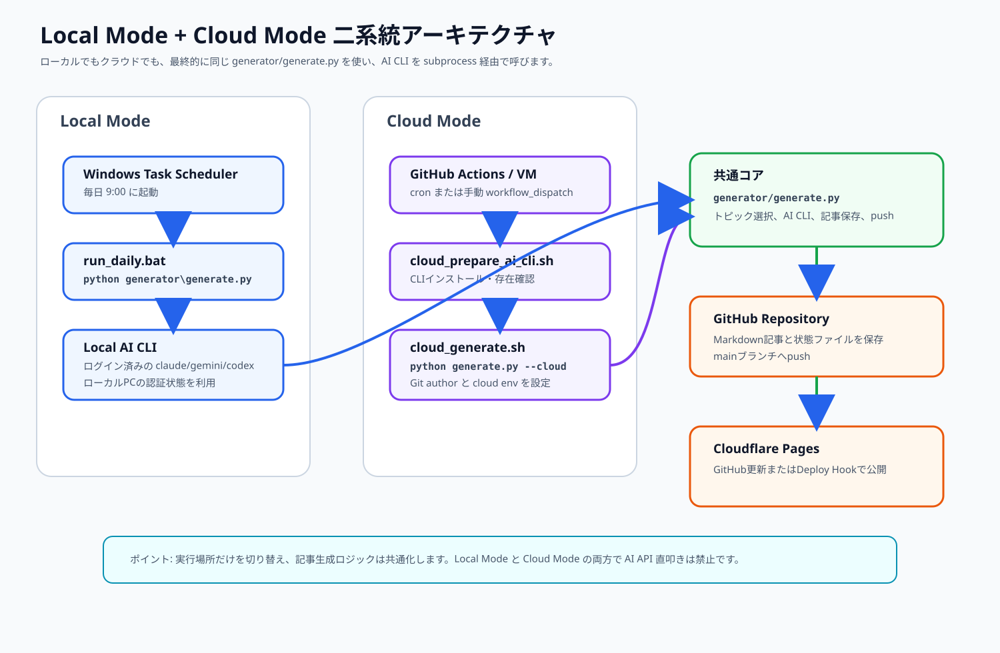

## 12. Cloud Mode GitHub Actions

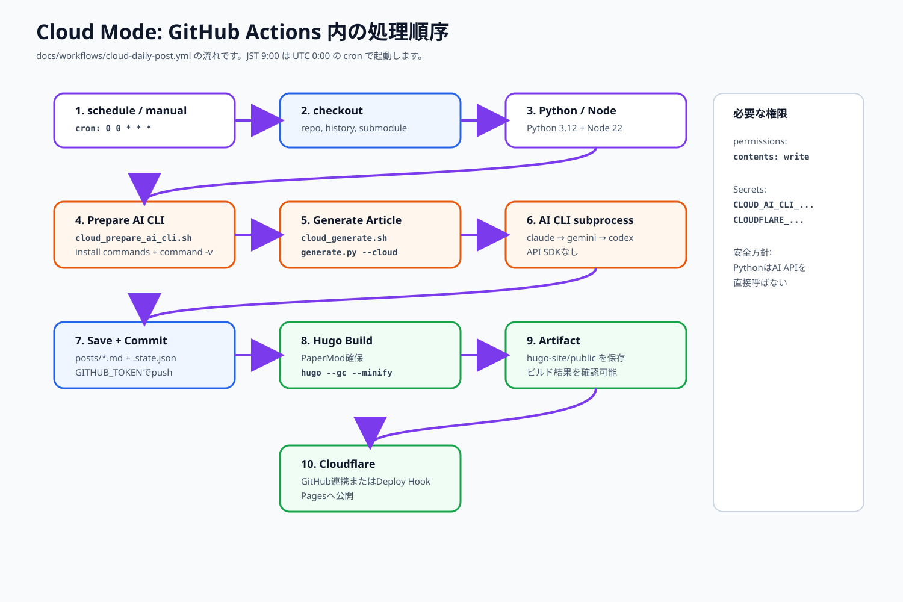

## 13. Cloud Secrets と CLI 認証

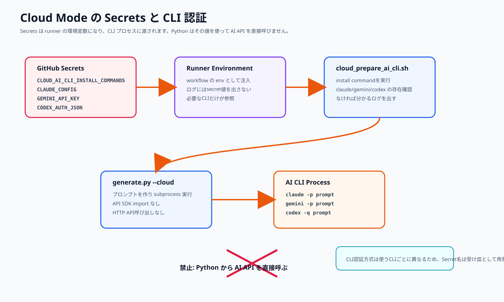

## 14. Cloudflare Deploy Hook

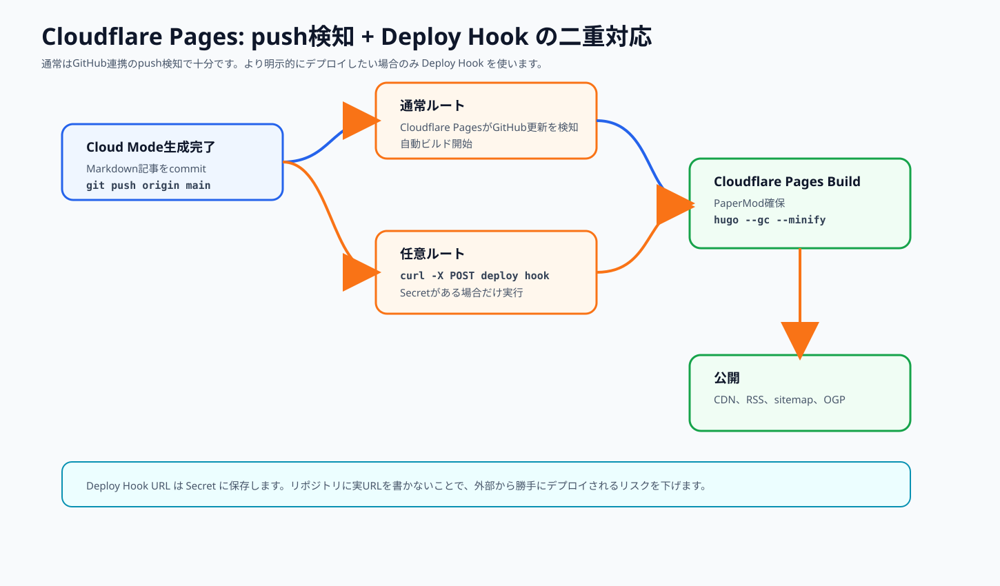

## 15. Cloud VM / self-hosted runner

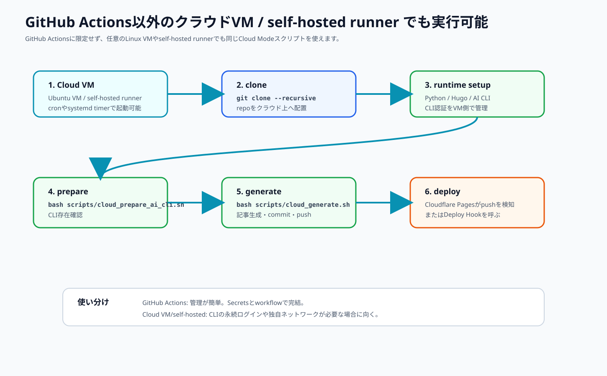
