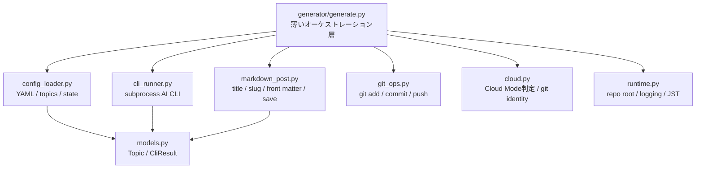

# リファクタリング記録

## 目的

`generator/generate.py` が記事生成、CLI実行、Markdown生成、git操作、Cloud Mode 判定まで抱えていたため、責務ごとの小さなモジュールへ分割しました。

外部仕様は維持しています。

- Local Mode: `python generator/generate.py`
- Cloud Mode: `python generator/generate.py --cloud`
- AI API 不使用
- AI CLI は `subprocess` 経由のみ
- front matter 形式は維持
- git commit / push 処理は維持

## 新しいモジュール構成



## ファイル別責務

| ファイル | 責務 |
|---|---|
| `generator/generate.py` | 全体処理の順番を制御する薄い入口。CLI引数もここ。 |
| `generator/models.py` | `Topic`、`CliResult` の共有データ構造。 |
| `generator/config_loader.py` | `config.yaml`、`topics.yaml`、`.state.json` の読み書き。 |
| `generator/cli_runner.py` | `claude`、`gemini`、`codex` の `subprocess` 実行とフォールバック。 |
| `generator/markdown_post.py` | Markdown本文の整理、title抽出、slug生成、front matter生成、記事保存。 |
| `generator/git_ops.py` | git add / commit / push、push branch 解決、push retry。 |
| `generator/cloud.py` | Cloud Mode 判定、クラウド実行時の git identity 設定、環境ログ。 |
| `generator/runtime.py` | JST timezone、repo root、logging setup。 |

## 変更後の generate.py

`generate.py` は以下だけを担当します。

1. 設定と状態を読み込む
2. Local / Cloud Mode を判定する
3. トピックを選ぶ
4. AI CLI の3段階処理を呼ぶ
5. Markdownを保存する
6. stateを更新する
7. git commit & push を呼ぶ

## 互換性

既存テストや既存利用コードが壊れにくいように、`generator/generate.py` から主要関数・クラスを再exportしています。

例:

```python
from generator import generate

generate.make_slug("タイトル")
generate.cloud_mode_enabled()
generate.get_push_branch({"branch": "main"})
```

新規コードでは、責務別モジュールを直接 import することを推奨します。

```python
from generator.markdown_post import make_slug
from generator.cli_runner import call_with_fallback
from generator.git_ops import commit_and_push
```

## リファクタリング後のテスト観点

- slug の hash fallback
- Hugo front matter 生成
- トピックローテーション
- CLI フォールバック
- front matter 除去
- Cloud Mode 判定
- push branch 解決

## 今後の改善候補

- `generate_article()` を `ArticleGenerationService` クラスへ切り出す
- 生成履歴の保存を専用 repository に分離する
- git 操作を dry-run しやすい interface にする
- CLI runner を protocol 化し、より細かい mock テストを追加する
