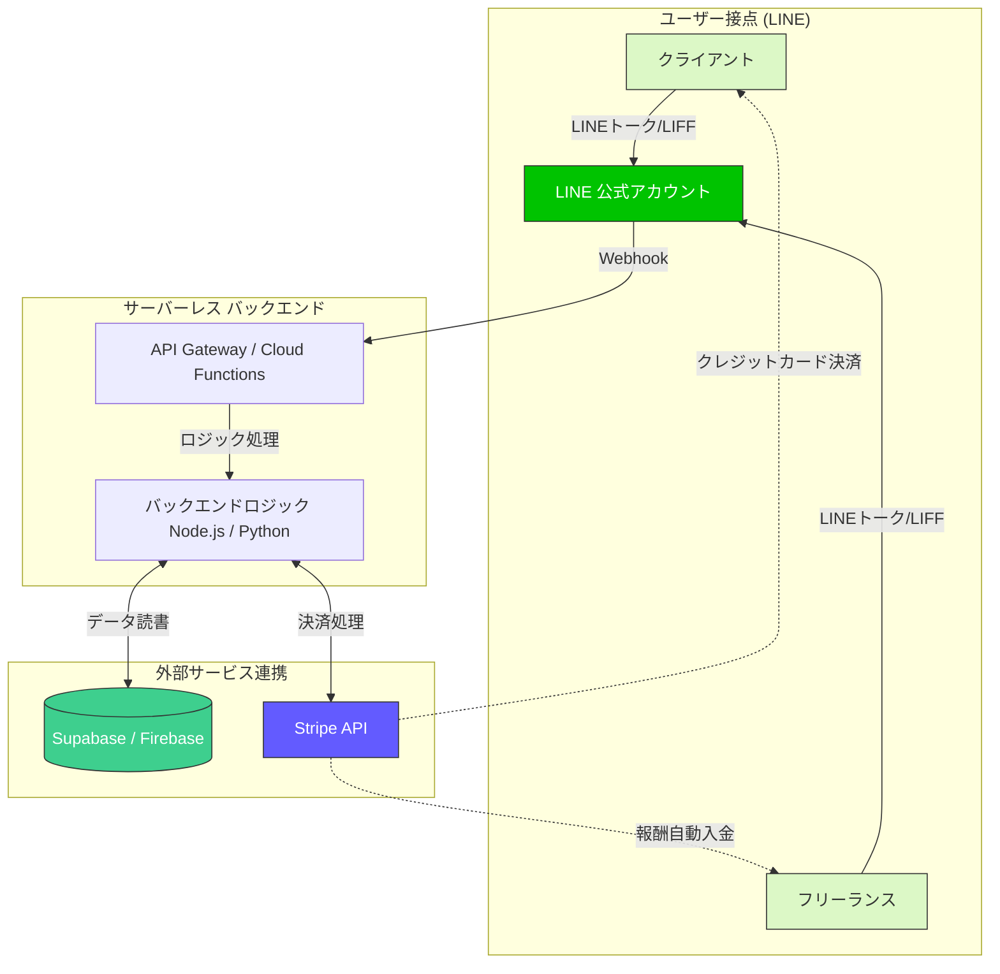

# 超ニッチ業種特化型フリーランスマッチングサービス システム設計図と構築マニュアル

「もっと自動的に稼げるものを」という要望に応える、**完全無人・自動決済（放置型）**のビジネスモデルです。
LINE Botをユーザー接点とし、Stripe決済と連携させることで、登録からマッチング、決済、報酬支払いまでの全プロセスを自動化します。

---

## 1. ビジネスモデルの概要

- **ターゲット**: 汎用的なクラウドソーシング（ランサーズやクラウドワークス）では埋もれてしまう「超ニッチな専門スキル」を持つフリーランスと、それを求めるクライアント。（例: 「特定のマイナーなCADソフト専門のモデラー」「特定のレトロゲーム機の修理職人」「ニッチな業界専門の翻訳家」など）
- **収益モデル**: 決済時の仲介手数料（プラットフォーム手数料）。Stripe Connectを利用して、クライアントからの支払いから手数料を自動で差し引き、残りをフリーランスへ送金します。
- **放置型・自動化のポイント**: 
  - ユーザーインターフェースをLINE（LIFF）で完結させ、アプリ開発・保守コストを削減。
  - Stripeによる決済と報酬の自動分配。
  - カスタマーサポートをFAQボットで一次対応。

---

## 2. システムアーキテクチャ（設計図）

サーバーレス構成とBaaS（Backend as a Service）を活用し、運用保守の手間とサーバーコストを最小化します。

### 【技術スタック】
- **フロントエンド（UI）**: LINE Messaging API, LIFF (LINE Front-end Framework) + React / Next.js
- **バックエンド**: AWS Lambda (API Gateway) または Vercel Serverless Functions / Cloudflare Workers
- **データベース**: Supabase (PostgreSQLベース、認証とDBを兼備)
- **決済・送金**: Stripe Connect (Custom または Expressアカウント)

---

## 3. ビジネスフロー（完全自動化のシナリオ）

1. **ユーザー登録**:
   - LINEで友だち追加。LIFFアプリが開き、クライアントまたはフリーランスとしてプロフィール・スキルを登録。
   - フリーランスはStripe Connectの登録フロー（本人確認・振込先口座の登録）を完了させる。
2. **案件の投稿と自動マッチング**:
   - クライアントがLINE上で案件条件（予算、納期、必要なニッチスキル）を入力。
   - DBが

条件に合致するフリーランスを自動抽出し、LINEメッセージ（プッシュ通知）で一斉配信。
3. **受注と仮払い（エスクロー）**:
   - 案件を受けたいフリーランスがLINEのボタンをタップし受注確定。
   - クライアントにStripeの決済リンクが送信され、クレジットカードで事前決済（Stripeの支払い確保・Authのみ、またはCharge）。
4. **納品と検収・自動送金**:
   - フリーランスが成果物をLINE上で報告（ファイルリンク等）。
   - クライアントが「検収完了」ボタンを押す。
   - バックエンドがStripe APIを叩き、クライアントの決済を確定。同時にプラットフォーム手数料を差し引いた金額をフリーランスのStripeアカウントへ自動送金。

---

## 4. 構築マニュアル（ステップバイステップ）

### Step 1: 企画とドメインの選定
- **ニッチ業種の決定**: 競合が少なく、単価がそこそこ高く、オンラインで完結しやすい業種を選びます。
- **手数料の設定**: 決済手数料（Stripe: 3.6%など）を考慮し、10〜20%程度のプラットフォーム手数料を設定します。

### Step 2: アカウントと環境の準備
1. **LINE Developers**: プロバイダーを作成し、「Messaging API」と「LIFF」のチャネルを作成します。
2. **Stripe**: アカウントを作成し、「Stripe Connect」を有効化します。（フリーランスの本人確認を自動化するため、Expressアカウントの利用を推奨）
3. **Supabase**: プロジェクトを作成し、データベースとAPIエンドポイントを用意します。

### Step 3: データベース設計 (Supabase)
最低限以下のテーブルを用意します。
- `users`: LINE_ID, ユーザータイプ（発注者/受注者）, Stripe Account ID, プロフィール情報
- `jobs`: 案件ID, 発注者ID, 受注者ID, 案件内容, 報酬額, ステータス（募集中/進行中/納品済/完了）
- `transactions`: 決済トランザクション履歴

### Step 4: バックエンド・LINE Bot実装
1. サーバーレス環境（Vercelなど）にWebhook受信用エンドポイントを作成。
2. LINEから送られてくるテキストやPostbackイベントを解析し、Supabaseと連携。
3. LIFFアプリ（React等で構築）をデプロイし、LINE DevelopersでエンドポイントURLを設定。ユーザー登録画面や案件投稿画面を作ります。

### Step 5: Stripe Connectによる自動決済の実装
Stripe APIを使用して、以下のロジックをバックエンドに組み込みます。
1. **フリーランスのオンボーディング**: `stripe.accountLinks.create` で本人確認URLを発行し、LIFFからリダイレクトさせる。
2. **支払い（クライアント側）**: `stripe.paymentIntents.create` で決済用URLを発行。
3. **報酬の分配（自動化）**: 決済時に `transfer_data` パラメータを使用して、宛先（フリーランスのStripe Account ID）を動的に指定。これにより、クライアントが決済した瞬間に（または検収完了時に）、運営口座を通さず直接フリーランスの口座へ手数料が引かれた額が移動します（資金決済法の複雑な要件を回避しやすくなります）。

### Step 6: 運用テストと公開
- LINEのテストアカウント、Stripeのテスト環境（Test Mode）を用いて、登録〜マッチング〜決済〜送金の一連のフローをテストします。
- 問題なければ本番環境（Live Mode）に切り替え、SNSやニッチ業界のコミュニティなどで集客を開始します。

---

## 5. 放置化（完全無人運営）を維持するための重要ポイント

1. **資金決済法の回避と税務の自動化**
   Stripe Connectを利用することで、プラットフォーム側がユーザーの資金を預かることなく、決済と送金をStripeに一任できます。これにより法的なリスクと経理の手間を削減できます。
2. 

**トラブルのエスカレーション防止**
   検収での揉め事を減らすため、LIFF画面上に「利用規約」として「◯日以内に検収しない場合は自動で決済確定とする」などのルールを明記し、システム的に自動決済確定バッチ（Cron等）を回します。
3. **サポートの自動化**
   よくある質問はすべてLINEの「リッチメニュー」と「自動応答メッセージ（AI Chatbot等）」に集約し、人間が対応する機会を極限まで減らします。

> [!TIP]
> **最初の集客がカギ**
> システムは全自動化できますが、初期の「クライアント」と「フリーランス」のニワトリタマゴ問題を解決するための初期マーケティング（XでのDM営業や、特定の業界フォーラムへの書き込みなど）のみ、立ち上げ時に注力する必要があります。軌道に乗れば、ニッチゆえに口コミで広がりやすくなります。

