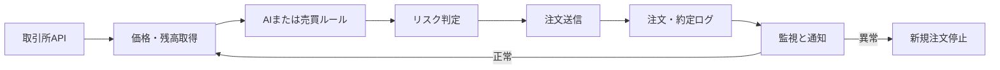

「自動トレードプログラムは作ったのに、自宅PCを切ると止まる」「VPSへ移したものの、再起動後にBotが動いているか分からない」「APIキーをサーバーへ置くのが怖い」。

このような不安を残したままBotを本番稼働させると、停止に気づけないだけでなく、通信エラー後の注文重複やAPIキーの流出によって、損失が拡大する可能性があります。

この記事では、Python製の自動トレードBotをLinux VPSへ配置し、自動起動、ログ保存、死活監視、異常通知、安全停止まで実装する流れを解説します。

目標は、単に「24時間起動しているプログラム」を作ることではありません。人間が画面を見続けなくても、平常時は動き、異常時は安全側へ停止し、判断が必要なときだけ通知される**運用可能な自動化資産**を作ることです。

なお、本稿はVPSとBot運用に関する一般的な技術情報です。特定の金融商品、取引所、売買方法を推奨するものではなく、利益を保証するものでもありません。取引所の規約、居住国の法令、税務上の扱いを確認し、テスト環境または損失を許容できる範囲で検証してください。

## 自動トレードBotとVPSの全体像

VPS（Virtual Private Server）とは、インターネット上で借りる仮想サーバーです。自宅PCとは別の場所にあるLinuxマシンを月額で借り、SSHという暗号化通信を使って操作します。

AIトレードBotは、おおむね次の流れで動きます。

1. 取引所APIから価格、板情報、保有残高を取得する
2. ルールまたはAIモデルで売買候補を判定する
3. 注文条件、数量、損失上限を検査する
4. 取引所APIへ注文を送信する
5. 注文結果、約定、残高、エラーをログへ保存する
6. 異常時には新規注文を止め、管理者へ通知する

ここでいうAPIとは、サービス同士が情報を受け渡すための窓口です。ブラウザを開かなくても、Pythonから現在価格を取得したり、許可された範囲で注文を送信したりできます。

VPSを導入しても、売買ロジックの期待値が上がるわけではありません。VPSによって改善できるのは、主に**稼働時間、通信の安定性、再起動後の復旧、ログの継続性**です。

利益を生む条件は別途、取引手数料、スプレッド、スリッページ、資金調達コスト、税金などを含めて検証する必要があります。



無人運用に近づけるには、注文処理だけでなく、障害検知と安全停止まで自動化しなければなりません。

目指すのは「勝手に動き続けるBot」ではなく、**自分で異常を検知し、安全に止まれるBot**です。

## Hiroのリポジトリで確認した一次情報

この記事の作成にあたり、2026年7月18日にHiroの `auto-ai-blog` リポジトリを確認しました。

リポジトリ内の既存マニュアル `generator/source_manuals/vps_setup_manual.md` は、VPS契約から `systemd` による自動起動までを7工程で構成しています。

商品設定ファイル `generator/products.yaml` では、「完全無人AIトレードBot VPS環境構築マニュアル」の設定価格は**7,800円**で、収録項目は次の3点です。

- Ubuntu VPS初期設定
- `screen`／`systemd`による常時稼働
- APIキー管理と少額テスト運用

これらは2026年7月18日時点のリポジトリ設定値です。売上、利益、Botの稼働率、運用成績を示す数字ではありません。

また、同リポジトリ内には、実取引の約定履歴や収益率を第三者が検証できるログは収録されていません。そのため、本稿では「HiroのBotで利益が出た」「完全放置で稼げた」といった未確認の主張は行いません。

既存マニュアルを点検したところ、`systemd` のサービス定義には次の改善点がありました。

- `Description=Arbitrage Trading Bot` の途中に不要な改行がある
- Botを `root` ユーザーで常時実行する設定になっている
- APIキーの保存場所とファイル権限が明示されていない
- `Restart=always` により、停止すべき異常でも再起動する可能性がある
- 再起動試験、注文重複防止、外部監視、停止条件が手順に含まれていない

一般的なVPS入門記事は、「SSH接続後に `screen` で起動して完了」となりがちです。本稿では、その先にある**非root実行、秘密情報の分離、注文の冪等性、再起動試験、KPI監視**まで扱います。

記事品質の確認に使われているテストも同日に実行しました。

```text
実行コマンド:
python -m pytest tests/test_validate_ai_slop.py tests/test_slop_guard.py -q

結果:
3テスト通過
終了コード: 0
```

これは記事検査機能のテスト結果であり、トレードBotの収益性、稼働率、安全性を証明するものではありません。

## ステップ・バイ・ステップで作るVPS環境


### 1. Botの安全条件を先に決める

VPSを契約する前に、Botが「どのような状況で新規注文を停止するか」を文章にします。

最低限、次の項目を決めてください。

- 1注文当たりの上限額
- 1日当たりの損失上限
- 最大保有数量
- 同時に出せる未約定注文数
- API通信が連続失敗した場合の停止回数
- 価格データが更新されない場合の停止時間
- 取引所残高とBot内部残高の許容差
- 人間の承認なしに再開してよい障害の範囲

数値は他人の設定をコピーせず、自分の資金量、取引頻度、バックテスト、フォワードテストの結果から決めます。

停止条件がないBotを `Restart=always` で動かすと、ロジック異常や認証エラーまで自動復旧し、失敗を繰り返す恐れがあります。

次の2種類を分けて設計してください。

- **プロセス障害**：メモリ不足や一時的な通信障害など、再起動で回復する可能性がある
- **取引上の異常**：損失上限、残高不一致、認証失敗など、自動再開させてはいけない

### 2. VPSとOSを選ぶ

初心者は、長期サポート版のUbuntu Serverを候補にすると、情報を探しやすくなります。契約時点の推奨LTSと、利用するPythonおよびライブラリの対応状況を確認してください。

[Ubuntu Server公式ドキュメント](https://ubuntu.com/server/docs/)

必要なスペックはBotの処理内容によって変わります。

- 単純な価格取得とルール判定：小規模構成から計測する
- pandasを使う複数市場分析：ピーク時のメモリ使用量を実測する
- 機械学習モデルをVPS内で推論：モデル読み込み後の最大メモリを確認する
- GPUを使った学習：低価格VPSではなく、学習専用環境を検討する

CPU数やメモリ量だけでなく、次の項目も比較します。

- 対象取引所までの通信遅延
- 固定IPの有無
- スナップショットと復元方法
- 障害情報の公開状況
- バックアップ料金
- 転送量の上限
- サポート体制

### 3. 管理者とBotのユーザーを分離する

日常のSSH作業に使う管理者ユーザーと、Botを動かすサービスユーザーを分けます。

まず、管理作業用のユーザーを作成します。

```bash
sudo adduser opsadmin
sudo usermod -aG sudo opsadmin
```

次に、SSHログインできないBot専用ユーザーを作成します。

```bash
sudo useradd \
  --system \
  --create-home \
  --home-dir /var/lib/trading-bot \
  --shell /usr/sbin/nologin \
  tradebot
```

SSH鍵はローカルPCで作成します。

```bash
ssh-keygen -t ed25519
ssh-copy-id opsadmin@YOUR_VPS_IP
```

Ubuntu公式もOpenSSHの設定方法を案内しています。

[Ubuntu OpenSSH Serverガイド](https://ubuntu.com/server/docs/how-to/security/openssh-server/)

新しいターミナルから鍵で接続できることを確認してから、パスワードログインやrootログインを制限してください。先に接続確認をしないと、自分自身がサーバーへ入れなくなる場合があります。

### 4. 更新とファイアウォールを設定する

```bash
sudo apt update
sudo apt upgrade
sudo apt install -y python3 python3-venv git ufw unattended-upgrades
sudo ufw allow OpenSSH
sudo ufw enable
sudo ufw status verbose
```

Ubuntu公式は、定期更新、最小権限のユーザー、`ufw`、不要パッケージの削減などをセキュリティ施策として案内しています。

[Ubuntu Serverのセキュリティ提案](https://ubuntu.com/server/docs/explanation/security/security_suggestions/)

自動更新後に再起動が必要になる場合もあります。Botの保有ポジションや未約定注文を確認せず、任意の時刻に再起動する設計は危険です。

更新時間帯、再起動前の確認項目、メンテナンス中の新規注文停止手順を決めてください。

### 5. Python仮想環境へBotを配置する

管理者ユーザーでアプリケーションを配置し、Bot専用ユーザーには実行に必要な読み取り権限だけを与えます。

```bash
sudo install -d -o opsadmin -g tradebot -m 750 /opt/trading-bot
cd /opt/trading-bot

git clone YOUR_PRIVATE_REPOSITORY_URL app
cd app

python3 -m venv .venv
.venv/bin/python -m pip install --upgrade pip
.venv/bin/pip install -r requirements.txt

sudo chown -R opsadmin:tradebot /opt/trading-bot/app
sudo chmod -R g+rX /opt/trading-bot/app
```

Botの状態ファイルとログは、アプリケーション本体とは別の書き込み可能なディレクトリへ保存します。

```bash
sudo install -d -o tradebot -g tradebot -m 750 /var/lib/trading-bot
sudo install -d -o tradebot -g tradebot -m 750 /var/log/trading-bot
```

`venv` は、Bot専用のPythonとライブラリ環境を分離する仕組みです。別アプリのライブラリ更新がBotへ影響する事故を減らせます。

[Python公式venvドキュメント](https://docs.python.org/3/library/venv.html)

`requirements.txt` には、検証済みのバージョンを固定します。

```text
ccxt==検証済みバージョン
python-dotenv==検証済みバージョン
```

実際のバージョン番号は、テスト環境で価格取得、注文、取消、残高取得を確認したものを記録してください。

### 6. APIキーをコードから分離する

APIキーをPythonファイルやGitへ書き込まず、所有者だけが読める環境ファイルへ保存します。

```bash
sudo install -m 600 -o tradebot -g tradebot /dev/null /etc/trading-bot.env
sudoedit /etc/trading-bot.env
```

```text
EXCHANGE_API_KEY=your_key
EXCHANGE_API_SECRET=your_secret
BOT_MODE=paper
```

設定後、権限を確認します。

```bash
sudo stat -c "%U %G %a %n" /etc/trading-bot.env
```

期待する出力は次の形式です。

```text
tradebot tradebot 600 /etc/trading-bot.env
```

取引所側では、可能な範囲で次の制限を設定します。

- 出金権限を付けない
- Botに不要な権限を外す
- VPSの固定IPだけを許可する
- Botごとに別のAPIキーを発行する
- 秘密鍵をログへ出力しない
- 漏えい時に即時失効できる手順を残す

CCXT公式マニュアルでも、秘密鍵の非公開化、設定ファイルの権限制限、レート制限への対応が案内されています。

また、同じAPIキーを複数のCCXTインスタンスで同時利用すると、nonceエラーなどの原因になり得ます。

[CCXT公式マニュアル](https://github.com/ccxt/ccxt/wiki/manual)

### 7. 注文を出さないモードで動作確認する

最初は `BOT_MODE=paper` または取引所のテスト環境を使い、次の項目を確認します。

- 価格を取得できる
- サーバー時刻が同期されている
- 売買シグナルがログへ残る
- 注文候補額が上限を超えない
- APIタイムアウト時に無限再送しない
- 同じシグナルから注文を重複生成しない
- Bot停止後も未約定注文を把握できる
- APIキーや個人情報がログへ出ていない

特に重要なのが、注文処理の**冪等性**です。冪等性とは、同じ処理が複数回実行されても、結果が重複しない性質を指します。

注文には一意なクライアントIDを付け、再送前に取引所側の注文状態を照会します。

```python
client_order_id = build_order_id(
    strategy_id="strategy-a",
    symbol="BTC-JPY",
    signal_time=signal_timestamp,
)

saved_order = order_store.find(client_order_id)

if saved_order:
    return saved_order

exchange_order = exchange.fetch_order_by_client_id(client_order_id)

if exchange_order:
    order_store.save(exchange_order)
    return exchange_order

return exchange.create_order(
    symbol="BTC/JPY",
    order_type="limit",
    side="buy",
    amount=amount,
    price=price,
    params={"clientOrderId": client_order_id},
)
```

上記は概念例です。実際に使用できる注文IDや照会方法は、取引所とライブラリによって異なります。

APIタイムアウトは「注文失敗」とは限りません。注文は受理されたものの、応答だけが届かなかった可能性があります。状態確認をせずに再送すると、注文が重複する恐れがあります。

### 8. systemdで常時稼働させる

`screen` や `tmux` は、SSH切断後も作業セッションを残せるため、初期検証には便利です。

無人運用では、プロセス監視、自動起動、再起動制御を扱える `systemd` を使います。

```ini
# /etc/systemd/system/trading-bot.service
[Unit]
Description=AI Trading Bot
After=network-online.target
Wants=network-online.target
StartLimitIntervalSec=300
StartLimitBurst=3

[Service]
Type=simple
User=tradebot
Group=tradebot
WorkingDirectory=/opt/trading-bot/app
EnvironmentFile=/etc/trading-bot.env
ExecStart=/opt/trading-bot/app/.venv/bin/python /opt/trading-bot/app/bot.py
Restart=on-failure
RestartSec=15
TimeoutStopSec=30
KillSignal=SIGTERM

NoNewPrivileges=true
PrivateTmp=true
ProtectHome=true
ProtectSystem=strict
ReadWritePaths=/var/lib/trading-bot /var/log/trading-bot

[Install]
WantedBy=multi-user.target
```

`ProtectSystem=strict` などの制限は、Botが書き込む場所を明確にしたうえで導入してください。Botが別のディレクトリへ状態を保存する場合は、`ReadWritePaths` の調整が必要です。

設定を検査し、反映します。

```bash
sudo systemd-analyze verify /etc/systemd/system/trading-bot.service
sudo systemctl daemon-reload
sudo systemctl enable --now trading-bot
sudo systemctl status trading-bot
sudo journalctl -u trading-bot -n 100 --no-pager
```

`Restart=on-failure` は、一時的なプロセス障害からの復旧に使います。

一方、認証エラー、残高不一致、損失上限到達などでは、Bot自身が新規注文を停止し、人間の承認を待つ状態へ移る必要があります。

### 9. 正常終了と安全停止を実装する

`systemd` から停止されたとき、Botは次の順番で終了するのが理想です。

1. 新しい売買シグナルの受付を止める
2. 注文送信中の処理を確定または照会する
3. 未約定注文と保有ポジションを記録する
4. 最終heartbeatを保存する
5. ログをフラッシュして終了する

`SIGTERM` を無視して強制終了されると、注文状態が保存されない場合があります。Python側で停止シグナルを受け取り、安全に終了できるようにします。

```python
import signal

shutdown_requested = False


def request_shutdown(signum, frame):
    global shutdown_requested
    shutdown_requested = True


signal.signal(signal.SIGTERM, request_shutdown)
signal.signal(signal.SIGINT, request_shutdown)
```

停止時に未約定注文をすべて取り消すか、そのまま残すかは、戦略によって異なります。暗黙に決めず、運用ルールとして明文化してください。

### 10. 監視と通知を追加する

最低限、次のイベントをメール、Discord、Slackなどへ通知します。

- Botの起動・停止
- 注文作成・取消・約定
- API認証エラー
- 価格データの更新停止
- 残高不一致
- 日次損失上限への到達
- 短時間での連続再起動
- heartbeatの途絶

通知が多すぎると、重要な通知まで読まれなくなります。正常ログは保存し、即時対応が必要な事象だけをアラートとして送信します。

Bot自身からの通知だけでは不十分です。Botと通知処理が同時に停止すると、停止を知らせる通知も送れないためです。

外部の監視サービスから、次のようなheartbeatを確認します。

```text
最終heartbeat: 2026-07-18T09:00:00+09:00
Bot状態: running
取引モード: paper
最終価格取得: success
新規注文許可: false
日次損失上限到達: false
```

### 11. ログローテーションを設定する

ログを無制限に保存すると、ディスク容量不足によってBotが停止する可能性があります。

ファイルへログを出す場合は、`logrotate` などで保存期間を制御します。

```conf
# /etc/logrotate.d/trading-bot
/var/log/trading-bot/*.log {
    daily
    rotate 14
    compress
    missingok
    notifempty
    copytruncate
}
```

設定をテストします。

```bash
sudo logrotate -d /etc/logrotate.d/trading-bot
```

`journalctl` を使用する場合も、保存容量と保持期間を確認してください。

### 12. 再起動試験を実施する

VPS構築の完了条件は、`systemctl status` が一度 `active` になったことではありません。

テストモードでVPSを再起動します。

```bash
sudo reboot
```

再接続後、次を確認します。

```bash
systemctl is-active trading-bot
systemctl is-enabled trading-bot
journalctl -u trading-bot --since "30 minutes ago"
```

合格条件を明確にします。

- `systemctl is-active trading-bot` が `active`
- `systemctl is-enabled trading-bot` が `enabled`
- 起動後にheartbeatが更新されている
- 再起動前の状態ファイルを読み込めている
- 同じシグナルから注文が再生成されていない
- APIキーがログへ出力されていない
- 異常時に通知が届く
- 新規注文停止フラグが再起動後も維持される

さらに、テスト環境で次の障害を再現します。

- ネットワーク切断
- APIタイムアウト
- プロセス強制終了
- API認証エラー
- 古い価格データの受信
- ディスク容量不足
- 取引所残高と内部状態の不一致

実資金が入った状態で障害試験を行わないでください。

## 専門家目線のチェックポイント


### VPSの安定性と売買ロジックを分離する

Botが止まらないことと、利益が出ることは別の評価軸です。

| 評価対象 | 主な指標 |
|---|---|
| VPS | 稼働率、再起動回数、API遅延、ログ欠損 |
| 戦略 | 手数料控除後損益、最大ドローダウン、約定率、スリッページ |
| 運用 | 通知から対応までの時間、誤注文、手動介入回数 |

自動化資産として価値があるのは、人間の監視時間を減らしながら、障害と損失を追跡できる仕組みです。

### AIの出力を直接注文へ渡さない

ニュース要約や価格予測をAIへ任せる場合でも、AIの出力をそのまま売買命令に変換する構成は避けます。

AIが出した候補に対し、独立した決定層で次の条件を検査してください。

- 対象銘柄が許可リスト内か
- 注文数量が上限内か
- 価格データが古くないか
- 既存ポジションと衝突しないか
- 損失上限を超えないか
- モデル出力が欠損値や異常値ではないか
- 同一シグナルが処理済みではないか
- 取引所がメンテナンス中ではないか

AIは売買候補を提示する役割に限定し、最終的な注文可否は、検証可能なルールで決める構成が安全です。

### 「完全無人」という言葉の限界を理解する

取引所の仕様変更、API障害、規制変更、VPSメンテナンス、ライブラリ更新には、人間の判断が必要です。

現実的な到達点は、**平常時の操作を自動化し、異常時だけ人間へ判断を戻す運用**です。

完全放置を追い過ぎると、停止すべき場面でも再起動を繰り返す危険があります。「完全無人」は設計上の方向性であり、無期限に保守が不要という意味ではありません。

## 実運用で残すべき証拠

運用の信頼性を説明するには、抽象的な主張ではなく、日時付きの証拠を残します。

### 1. システム構成図

取引所API、VPS、AI判定、リスク管理、注文処理、ログ、通知の接続関係を示します。

### 2. systemdの稼働画面

個人情報を隠したうえで、次の画面を保存します。

```bash
systemctl status trading-bot
journalctl -u trading-bot -n 100 --no-pager
```

`active` の表示だけでなく、起動時刻、終了理由、再起動回数も確認します。

### 3. 運用ダッシュボード

次の指標を1画面にまとめます。

- 最終heartbeat時刻
- API応答時間
- APIエラー率
- 注文数
- 注文重複件数
- 日次損益
- 最大ドローダウン
- Botの停止状態
- 新規注文の許可状態

収益額を掲載する場合は、対象期間、元本、手数料、スリッページ、VPS費用、税引前・税引後の区別を添えてください。

### 4. 障害試験記録

次の形式で、障害試験の結果を保存します。

```text
試験日時:
対象バージョン:
取引モード:
発生させた障害:
期待する動作:
実際の動作:
新規注文の有無:
重複注文の有無:
通知の到達時刻:
復旧方法:
判定: PASS / FAIL
```

この記録があれば、コード更新後に同じ安全性を維持できているか比較できます。

## よくある失敗と対策

| 失敗 | 主な原因 | 対策 |
|---|---|---|
| SSHを切るとBotも止まる | 通常のターミナルで直接起動 | 検証は `screen`、運用は `systemd` |
| 再起動後に起動しない | `enable` 忘れ、パス間違い | `is-enabled` の確認とVPS再起動試験 |
| APIキーが漏れる | コードやGitへ直書き | 環境ファイル、権限600、キー再発行 |
| 同じ注文が複数回出る | タイムアウトを失敗と断定 | 注文IDを保存し、再送前に照会 |
| APIアクセスを拒否される | 高頻度アクセス、複数インスタンス | レート制限を守り、インスタンスを再利用 |
| Botが再起動を繰り返す | 永続的な認証・設定エラー | 再起動回数を制限し、安全な待機状態へ移行 |
| ログでディスクが埋まる | ローテーション未設定 | `logrotate` または保存期間を設定 |
| 利益が出ているように見える | 手数料やスリッページが未計上 | 取引所明細と突合し、実現損益で評価 |
| 通知が届かない | Botと通知処理が同時に停止 | 外部監視からheartbeatを確認 |
| 停止後に状態が分からない | 注文・残高の永続化不足 | 状態ファイルと取引所情報を起動時に照合 |
| Bot更新後に突然動かない | 依存ライブラリの非互換 | バージョン固定とテスト環境での事前確認 |

## 成果を測るKPI

無人運用のKPIは、利益だけでなく「人間の作業時間をどれだけ減らせたか」まで測ります。

- **稼働率**  
  `正常稼働時間 ÷ 測定対象時間`  
  取引所メンテナンスなど、除外する時間の条件も記録します。

- **heartbeat遅延**  
  Botが最後に正常信号を送ってからの経過時間です。許容値はBotの取引間隔を前提に決めます。

- **APIエラー率**  
  `APIエラー件数 ÷ APIリクエスト総数`

- **注文重複件数**  
  同一シグナルまたは同一クライアントIDから重複した注文数です。目標は0件です。

- **手動介入回数**  
  週または月に、人間が再起動、注文取消、設定修正を行った回数です。

- **平均復旧時間**  
  `障害発生から正常状態へ戻るまでの合計時間 ÷ 障害件数`

- **運用時間削減率**  
  `(手動運用時の確認時間 − 自動化後の確認時間) ÷ 手動運用時の確認時間`

- **手数料控除後損益**  
  売買損益から、取引手数料、資金調達コスト、スリッページ、VPS費用を差し引きます。

- **最大ドローダウン**  
  評価期間中の資産ピークからの最大下落幅です。期間、元本、現物・レバレッジの条件を併記します。

KPIは最低でも日次ログとして保存し、週次で確認します。

Botの稼働率が高くても、注文重複や手数料控除後損失が増えているなら、運用は成功していません。

## 初心者向け：今日実施する30分の準備

まだVPSを契約していない場合は、最初に次の5項目を書き出してください。

```text
1注文当たりの上限:
1日当たりの損失上限:
APIキーに付ける権限:
異常通知の送信先:
Botを停止する条件:
```

すでにBotがある場合は、次の順番で確認します。

1. 注文を出さないモードがあるか確認する
2. APIキーがコードへ直接書かれていないか確認する
3. 同じシグナルを2回処理しても注文が重複しないか試す
4. Botを途中で強制終了し、再起動後の状態を確認する
5. テスト結果を日時付きで保存する

この5項目を完了してから、VPSへの配置へ進んでください。

## 本番移行前の最終チェックリスト

次の項目をすべて満たすまでは、実資金での運用を始めないでください。

- [ ] テスト環境またはpaperモードで動作する
- [ ] 1注文当たりの上限がコードで強制される
- [ ] 1日当たりの損失上限で新規注文が停止する
- [ ] APIキーに出金権限がない
- [ ] APIキーがGitとログに含まれていない
- [ ] 環境ファイルの権限が600になっている
- [ ] Botがroot以外のユーザーで動く
- [ ] 注文へ一意なクライアントIDを付けている
- [ ] タイムアウト後、再送前に注文状態を照会する
- [ ] VPS再起動後に状態を復元できる
- [ ] heartbeatを外部から監視できる
- [ ] 連続再起動を検知できる
- [ ] ログの保存期間と容量上限を設定している
- [ ] 手動停止と安全な再開の手順を残している
- [ ] 障害試験の結果を日時付きで保存している

## まとめ：止まらないことより、安全に止まれることが重要

自動トレードを「毎日画面を見る作業」から「ログと通知で管理できる仕組み」へ変えるには、売買ロジックより先に、安全停止と観測の仕組みを整える必要があります。

重要なのは、次の5点です。

- Botをroot権限で動かさない
- APIキーをコードから分離する
- 注文処理を冪等にする
- 異常時には新規注文を停止する
- 再起動と障害を実際に試験する

VPS上でプロセスが動き続けているだけでは、無人運用とはいえません。

平常時には人間が介在せず、異常時には安全側へ停止し、何が起きたかをログから再現できる状態を作ることが、実務上の「自動化」です。

## 本気で自動化・不労所得を構築したい方へ

VPSの契約、SSH設定、Python環境、`screen`／`systemd`、APIキー管理――断片的な情報を拾い集めていると、設定漏れの発見だけで何日も消耗します。

もし目指しているのが、試しにBotを起動することではなく、**自分が眠っている間も動き、異常時には止まり、改善データが残る自動化資産**なら、実装の順序を最初から揃えてください。

商品一覧ページでは、完全無人AIトレードBotのVPS環境構築をはじめ、AIによる集客、コンテンツ販売、アフィリエイトなど、労働時間に依存しにくい仕組みを作るための実践マニュアルを公開しています。

**「いつか自動化したい」を、今日の構築作業へ変える方はこちらからご覧ください。**

[本気で自動化・不労所得を構築したい方向けの実践マニュアルを見る](/products/)
