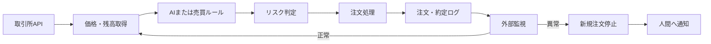

「自動トレードBotを作ったのに、自宅PCを消すと止まる」「VPSへ移したが、再起動後も動いているか分からない」「APIキーをサーバーへ置くのが怖い」。

こうした不安を残したままAIトレードBotを稼働させると、停止に気づけないだけでなく、通信エラー後の注文重複やAPIキーの漏えいによって損失が広がる恐れがあります。

この記事では、Python製の**AIトレードBotをVPSへ配置し、自動起動、ログ保存、死活監視、異常通知、安全停止まで実装する順序**を解説します。

目標は、単に起動したまま放置するプログラムではありません。平常時は人間が画面を見続ける必要がなく、異常時には新規注文を止め、判断が必要なときだけ通知する「運用可能な自動化資産」を作ることです。

なお、本稿はVPSとBot運用に関する一般的な技術情報です。特定の金融商品、取引所、売買手法を推奨するものではなく、利益も保証しません。取引所の規約、居住国の法令、税務上の扱いを確認し、テスト環境または損失を許容できる範囲で検証してください。

## AIトレードBotとVPSの全体像

VPS（Virtual Private Server）とは、インターネット上で借りる仮想サーバーです。自宅PCとは別の場所で常時稼働するLinuxマシンへ、SSHという暗号化通信を使って接続し、Botを実行します。

AIトレードBotの処理は、おおむね次のように流れます。

1. 取引所APIから価格、板情報、残高を取得する
2. 売買ルールまたはAIモデルが取引候補を出す
3. 注文数量、損失上限、データ鮮度を検査する
4. 条件を満たした注文だけを取引所APIへ送る
5. 注文結果、約定、残高、エラーをログへ保存する
6. 異常を検知したら新規注文を停止し、管理者へ通知する

APIとは、サービス同士がデータを受け渡すための窓口です。たとえば、ブラウザで取引画面を開かなくても、Pythonから現在価格や残高を取得できます。

VPSを導入しても、売買ロジックの期待値は上がりません。改善できるのは、主に**稼働時間、通信の継続性、再起動後の復旧、ログの保存**です。利益を評価するには、手数料、スプレッド、スリッページ、資金調達コスト、税金まで別途計算する必要があります。



この構成なら、人間が毎回ログインして確認する時間を減らしつつ、異常を放置する危険も抑えられます。

## Hiro運営サイトで確認した一次情報と検証結果

2026年7月22日、Hiro運営サイトの `auto-ai-blog` リポジトリを確認しました。

既存資料 `generator/source_manuals/vps_setup_manual.md` は、VPS契約から `systemd` による自動起動までの**7工程**で構成されています。商品設定 `generator/products.yaml` に登録されている価格は**7,800円**で、購入者向け収録項目として次の3点が記載されています。

- Ubuntu VPS初期設定
- `screen`／`systemd` による常時稼働
- APIキー管理と少額テスト運用

7工程、7,800円、3項目という数字は、2026年7月22日時点のリポジトリ設定値です。売上やBotの運用成績を表す数字ではありません。

確認した証拠と限界を整理すると、次のようになります。

| 確認対象 | リポジトリ内の証拠 | 確認結果 |
|---|---|---|
| マニュアルの工程数 | `generator/source_manuals/vps_setup_manual.md` | 7工程 |
| 商品価格 | `generator/products.yaml` の `price_jpy` | 7,800円 |
| 実行ユーザー | 既存サービス定義の `User=root` | 権限分離が必要 |
| 再起動設定 | 既存サービス定義の `Restart=always` | 安全停止後も再起動する恐れあり |
| APIキーの保存先 | 具体的な環境ファイル設定なし | コード・Gitとの分離手順が必要 |
| 実取引の成績 | 第三者が検証できる約定履歴なし | 収益性は確認不能 |

同日、記事品質を検査する機能のテストも実行しました。

```text
実行コマンド:
python -m pytest tests/test_validate_ai_slop.py tests/test_slop_guard.py -q

結果:
... [100%]
終了コード: 0
```

これはAIスロップ防止機能に対する3件のテストが通過した記録です。この記事自体の品質点、Botの収益性、取引の安全性を証明するものではありません。

また、リポジトリ内には、第三者が検証できる実取引の約定履歴や収益ログがありません。そのため、「HiroのBotが完全放置で利益を出した」といった未確認の主張は行いません。

既存マニュアルを点検したところ、サービスをrootで動かす設定、APIキーの具体的な保存方法が未記載である点、`Restart=always` によって安全停止後も再起動する可能性など、実運用前に修正すべき箇所が見つかりました。

一般的なVPS記事が `screen` で起動するところまでで終わるのに対し、本稿では**非root実行、秘密情報の分離、注文重複防止、安全停止、外部監視、KPI**まで扱います。ここが類似記事との差別化ポイントです。

なお、記事内の3点の画像は構成を理解するための概念図であり、実際のVPSや取引所から取得したスクリーンショットではありません。実運用の成績や稼働実績を示す証拠としては扱わないでください。

## 12ステップで作るVPS環境


### 1. Botを停止させる条件を決める

VPSを契約する前に、次の項目を書き出します。

- 1注文当たりの上限
- 1日当たりの損失上限
- 最大保有数量
- 未約定注文の上限
- API通信が連続失敗した場合の停止条件
- 価格データを「古い」と判定する時間
- Bot内部残高と取引所残高の許容差
- 人間の承認なしで再開できる障害の範囲

数値は、資金量、取引頻度、バックテスト、フォワードテストの条件から決めます。根拠なく他人の上限値をコピーしても、自分の資金量や戦略には合わない可能性があります。

「一時的なネットワーク障害」と「損失上限への到達」は分けて扱ってください。前者は再試行や再起動で回復する余地がありますが、後者を自動再開すると損失が拡大しかねません。

### 2. VPSとOSを選ぶ

2026年7月時点では、サポート期間を確認したLTS版を選びます。Ubuntu 24.04 LTSは、標準のセキュリティ保守が**2029年5月まで**提供される予定です。[Ubuntu 24.04 LTS公式リリースノート](https://documentation.ubuntu.com/release-notes/24.04/)

単純な価格取得Botなら小規模プランから始め、CPU、メモリ、ディスク使用量を測ってから増強します。機械学習モデルをVPS内で推論する場合は、モデル読み込み後のピークメモリを実測してください。

比較項目は次のとおりです。

- 対応OSとサポート期間
- VPS障害時の復旧方法
- スナップショット料金
- 転送量制限
- 固定IPの有無
- データセンターの地域
- メンテナンス通知の方法

### 3. SSH鍵と専用ユーザーを設定する

rootで日常作業を続けず、保守担当者とBotのユーザーを分離します。

```bash
sudo adduser opsadmin
sudo usermod -aG sudo opsadmin

sudo useradd \
  --system \
  --home /opt/trading-bot \
  --shell /usr/sbin/nologin \
  tradebot
```

`opsadmin` は保守作業用、`tradebot` はBot実行専用です。仮にBotが侵害されても、サーバー全体を操作される範囲を小さくできます。

新しいターミナルからSSH鍵で接続できることを確認してから、rootログインやパスワード認証を制限します。順序を逆にすると、自分もサーバーへ入れなくなる場合があります。

設定を変更する前に、VPS事業者が提供する管理コンソールやレスキューモードの有無も確認してください。

### 4. 更新とファイアウォールを設定する

```bash
sudo apt update
sudo apt full-upgrade -y
sudo apt install -y ufw git python3-venv
sudo ufw allow OpenSSH
sudo ufw enable
sudo ufw status verbose
```

Ubuntu公式によると、`ufw` はホスト型ファイアウォールを扱いやすくするツールで、初期状態では無効です。[Ubuntu Serverのファイアウォール解説](https://ubuntu.com/server/docs/how-to/security/firewalls/)

VPS事業者側にもファイアウォール機能がある場合は、SSH接続元を自分のIPへ限定できるか検討します。IPが頻繁に変わる回線では、設定後に接続不能にならないよう、管理コンソールなどの代替経路も準備してください。

### 5. Python仮想環境へBotを配置する

```bash
sudo install -d -o opsadmin -g tradebot -m 2750 \
  /opt/trading-bot/app

sudo install -d -o tradebot -g tradebot -m 750 \
  /var/lib/trading-bot

sudo install -d -o tradebot -g tradebot -m 750 \
  /var/log/trading-bot
```

Botのソースコードと `requirements.txt` を `/opt/trading-bot/app` へ配置した後、保守用ユーザーで仮想環境を作ります。

```bash
cd /opt/trading-bot/app
python3 -m venv .venv
.venv/bin/pip install -r requirements.txt
```

`venv` は、Bot専用のPythonライブラリ環境を作る仕組みです。別アプリの更新がBotへ影響する事故を減らせます。[Python公式venvドキュメント](https://docs.python.org/3/library/venv.html)

`requirements.txt` には、価格取得、注文、取消、残高照会までテストしたライブラリのバージョンを固定します。「最新版へ自動更新」は互換性障害につながるため、検証環境を通してから本番へ反映します。

### 6. APIキーをコードとGitから分離する

```bash
sudo install -o root -g tradebot -m 640 /dev/null \
  /etc/trading-bot.env

sudoedit /etc/trading-bot.env
```

```dotenv
EXCHANGE_API_KEY=your_api_key
EXCHANGE_API_SECRET=your_secret
BOT_MODE=paper
ALLOW_NEW_ORDERS=false
```

APIキーには、可能なら次の制限を付けます。

- 出金権限を付けない
- Botに不要な権限を外す
- VPSの固定IPだけを許可する
- Botごとに別のキーを発行する
- ログへ秘密情報を出力しない
- 漏えい時の失効手順を残す
- 定期的なローテーション手順を決める

`ALLOW_NEW_ORDERS=false` のまま、価格取得、残高照会、ログ保存、通知まで確認します。注文試験に進むときだけ、確認者と変更日時を記録したうえで有効化してください。

### 7. テストモードで注文重複を検査する

最初は `BOT_MODE=paper` または取引所のテスト環境で動かします。

同じシグナルを2回入力し、注文候補が重複しないか確認してください。注文には一意なクライアント注文IDを付け、処理済みのシグナルIDを永続化します。

```text
入力シグナルID: signal-20260722-001
1回目の結果: 注文候補を1件作成
2回目の結果: 処理済みとして拒否
生成された注文数: 1件
```

APIタイムアウトは、注文失敗を意味するとは限りません。注文は取引所に受理され、応答だけが届かなかった可能性があります。再送前に、クライアント注文IDを使って取引所側の注文状態を照会します。

CCXT公式も、`createOrder()` のタイムアウト後は注文一覧や残高を確認するよう案内しています。また、レート制限機能は既定で有効ですが、同じAPIキーで複数の取引所インスタンスを作ると制御が分散します。[CCXT公式マニュアル](https://github.com/ccxt/ccxt/wiki/manual)

### 8. systemdで自動起動する

初期確認には `screen` も使えますが、無人運用では再起動制御とログ管理ができる `systemd` を使います。

```ini
# /etc/systemd/system/trading-bot.service
[Unit]
Description=AI Trading Bot
After=network-online.target
Wants=network-online.target
StartLimitIntervalSec=300
StartLimitBurst=3

[Service]
Type=simple
User=tradebot
Group=tradebot
WorkingDirectory=/opt/trading-bot/app
EnvironmentFile=/etc/trading-bot.env
Environment=PYTHONDONTWRITEBYTECODE=1
ExecStart=/opt/trading-bot/app/.venv/bin/python bot.py

Restart=on-failure
RestartSec=15

NoNewPrivileges=true
PrivateTmp=true
ProtectHome=true
ProtectSystem=strict
ReadWritePaths=/var/lib/trading-bot /var/log/trading-bot
UMask=0027

[Install]
WantedBy=multi-user.target
```

`StartLimitIntervalSec` と `StartLimitBurst` は、`[Service]` ではなく `[Unit]` に記述します。配置を誤ると設定が無視される可能性があります。

設定を検証してから反映します。

```bash
sudo systemd-analyze verify \
  /etc/systemd/system/trading-bot.service

sudo systemctl daemon-reload
sudo systemctl enable --now trading-bot
sudo systemctl status trading-bot
sudo journalctl -u trading-bot -n 100 --no-pager
```

`Restart=on-failure` は、一時的なプロセス障害からの復旧に使います。一方、認証エラー、残高不一致、損失上限到達などは、Bot自身が新規注文を禁止して承認待ちへ移る設計にします。

安全停止をプロセス終了で表現する場合、終了コードによって再起動の要否を区別してください。より安全なのは、重大異常時も監視と通知だけを継続し、注文機能を停止した `HALTED` 状態へ遷移させる設計です。

### 9. 正常終了と状態保存を実装する

停止時は、次の順序で処理します。

1. 新しい売買シグナルを受け付けない
2. 送信中の注文状態を取引所へ照会する
3. 未約定注文と保有ポジションを保存する
4. 新規注文停止フラグを保存する
5. 最終heartbeatを記録する
6. ログを書き出して終了する

heartbeatとは、Botが正常に動いていることを定期的に示す信号です。次の情報を保存します。

```json
{
  "timestamp": "2026-07-22T12:00:00+09:00",
  "mode": "paper",
  "state": "RUNNING",
  "allow_new_orders": false,
  "last_market_data_at": "2026-07-22T11:59:58+09:00",
  "last_api_result": "ok",
  "bot_version": "1.4.2"
}
```

heartbeatにはAPIキー、シークレット、個人情報を含めないでください。

### 10. Botの外から監視する

Bot自身だけに通知させると、Botと通知処理が同時に止まったときに何も届きません。別プロセスまたは外部監視サービスからheartbeatを確認します。

即時通知する候補は次のとおりです。

- heartbeatの途絶
- API認証エラー
- 価格データの更新停止
- 残高不一致
- 日次損失上限への到達
- 短時間の連続再起動
- ディスク容量不足
- 新規注文停止状態への遷移

通知過多は見落としの原因になります。通常の価格取得はログへ残し、人間の判断が必要な異常だけを通知します。

通知には、少なくとも次の項目を含めます。

```text
発生時刻:
Bot名・バージョン:
稼働モード:
異常の種類:
新規注文の可否:
未約定注文数:
自動復旧の実施状況:
人間に求める操作:
```

### 11. ログ容量を制限する

ログを無制限に保存すると、ディスクが埋まり、Botが停止します。`journald` の上限、または `logrotate` の保存日数と容量を決めてください。

注文ログには、次の情報を残します。

- 日時
- シグナルID
- クライアント注文ID
- 銘柄と売買方向
- 注文前後の残高
- API応答
- 再試行回数
- Botバージョン
- 注文可否を決めたリスク判定

APIキー、シークレット、認証ヘッダー、個人情報はマスクします。

ログを保存するだけでなく、1件の注文について「どのシグナルから、どの判定を経て、どの取引所注文になったか」を追跡できることが重要です。

### 12. VPSを実際に再起動する

paperモードかつ `ALLOW_NEW_ORDERS=false` の状態で実行します。

```bash
sudo reboot
```

再接続後に、次のコマンドを実行します。

```bash
systemctl is-active trading-bot
systemctl is-enabled trading-bot
journalctl -u trading-bot --since "30 minutes ago"
```

合格条件は、サービスが `active` になったことだけではありません。

- heartbeatが再び更新される
- 再起動前の状態を読み込める
- 同じ注文を再生成していない
- 新規注文停止フラグが維持される
- 未約定注文を取引所と再照合している
- APIキーがログへ出ていない
- 異常を外部監視が検知できる

実資金を入れた状態で障害試験を行うのは避けてください。

## 専門家目線のチェックポイント


### AIの出力を注文へ直結させない

AIが売買候補を出しても、独立したルール層で次の項目を検査します。

- 銘柄が許可リスト内か
- 数量が上限内か
- 価格データが古くないか
- 損失上限へ達していないか
- 出力が欠損値や異常値ではないか
- 同一シグナルが処理済みではないか
- 取引所残高とBot内部残高が一致しているか

AIは候補生成に使い、注文可否はテスト可能なルールで決める方が、誤作動の原因を追跡しやすくなります。

### 「再試行可能」と「人間の承認が必要」を分ける

| 障害 | 自動再試行 | 新規注文 | 推奨対応 |
|---|---:|---:|---|
| 一時的な通信切断 | 可 | 一時停止 | 待機後に状態照会 |
| APIレート制限 | 可 | 一時停止 | 指定時間まで待機 |
| API認証エラー | 不可 | 停止 | キーと権限を確認 |
| 残高不一致 | 不可 | 停止 | 取引所明細と突合 |
| 日次損失上限到達 | 不可 | 停止 | 人間が再開判断 |
| 不明な注文状態 | 条件付き | 停止 | 注文IDで照会 |
| ディスク容量不足 | 不可 | 停止 | 容量確保後に確認 |

不明な状態で注文を再送するより、安全側へ停止して状態を照合する方が重要です。

### 稼働率と収益性を分ける

| 評価対象 | 確認する指標 |
|---|---|
| VPS | 稼働率、再起動回数、API遅延、ログ欠損 |
| 戦略 | 手数料控除後損益、約定率、スリッページ、最大ドローダウン |
| 運用 | 手動介入回数、平均復旧時間、誤注文件数 |

稼働率が高くても、期待値が負の戦略を長時間動かせば損失が増えます。反対に、戦略に期待値があってもBotが頻繁に停止すれば、検証結果を再現できません。

### 「完全無人」にも保守は必要

取引所の仕様変更、API障害、規制変更、VPSメンテナンス、Pythonライブラリの更新には、人間の判断が必要です。

現実的な完全自動化とは、**平常時の操作をなくし、異常時だけ人間へ判断を戻す状態**です。無期限の無監視運用を意味するものではありません。

## 公開前に追加したい実画面

現在掲載している画像は概念図です。記事の信頼性をさらに高めるには、個人情報や秘密情報を隠したうえで、次の実画面を追加します。

- `systemctl status trading-bot` のスクリーンショット
- 再起動前後のheartbeat時刻を並べた図
- API遅延、エラー率、手動介入回数を表示するダッシュボード
- 注文重複テストの入力IDと結果
- `systemd-analyze verify` の実行結果
- APIキーがログへ出ていないことを確認した検査結果

特に、「再起動前後で同一注文が増えていないこと」を示す画面は、単にプロセスが動いているスクリーンショットより強い運用証拠になります。

実画面を掲載する場合は、IPアドレス、ユーザー名、残高、注文ID、APIキー、通知先などを必ずマスクしてください。

## よくある失敗と対策

| 失敗 | 原因 | 対策 |
|---|---|---|
| SSHを切るとBotも止まる | ターミナルから直接起動 | 検証は `screen`、運用は `systemd` |
| 再起動後に動かない | `enable` 忘れ、パス間違い | VPS再起動試験を行う |
| APIキーが漏れる | コードやGitへ直書き | 環境ファイルと権限制限を使う |
| 注文が重複する | タイムアウトを失敗と断定 | 再送前に注文状態を照会する |
| 再起動を繰り返す | 認証・設定エラー | 再起動回数を制限し待機状態へ移す |
| 安全停止後に再起動する | 全障害を異常終了にしている | 再試行可能な障害と安全停止を分ける |
| ディスクが埋まる | ログ保存が無制限 | 保持期間と容量上限を設定する |
| 利益が出ているように見える | コスト未計上 | 取引所明細と突合する |
| 停止通知が来ない | Bot内の通知処理も同時停止 | 外部からheartbeatを監視する |

## 自動化の成果を測るKPI

- **稼働率**  
  `正常稼働時間 ÷ 測定対象時間`  
  取引所メンテナンスを除外する場合は、その条件も記録します。

- **heartbeat遅延**  
  最後の正常信号からの経過時間です。許容値はBotの実行間隔を前提に設定します。

- **APIエラー率**  
  `APIエラー件数 ÷ APIリクエスト総数`

- **注文重複件数**  
  同一シグナルから重複して生成された注文数です。目標は0件です。

- **不明注文の発生件数**  
  タイムアウトなどにより、取引所側での受理状況を即座に判定できなかった注文数です。

- **手動介入回数**  
  人間が再起動、注文取消、設定変更を行った回数です。

- **平均復旧時間**  
  `障害発生から復旧までの合計時間 ÷ 障害件数`

- **運用時間削減率**  
  `(手動運用時の確認時間 − 自動化後の確認時間) ÷ 手動運用時の確認時間`

- **手数料控除後損益**  
  売買損益から手数料、スリッページ、資金調達コスト、VPS費用を差し引きます。評価期間と元本も併記してください。

KPIは日次ログへ保存し、週次で確認します。人間の介在時間が減っても、注文重複や損失が増えているなら、自動化資産として改善が必要です。

## 今日から取れる具体的なアクション

まだVPSを契約していない人は、次の5項目を30分以内に書き出してください。

```text
1注文当たりの上限:
1日当たりの損失上限:
APIキーに付ける権限:
異常通知の送信先:
Botを停止する条件:
```

すでにBotがある場合は、paperモードで同じシグナルを2回入力し、注文候補が1件しか生成されないか確認します。結果を日時、Botバージョン、入力IDと一緒に保存してください。

次に何をすればよいか迷った場合は、次の順番で進めます。

1. `ALLOW_NEW_ORDERS=false` で価格取得と残高照会を確認する
2. 同一シグナルを2回入力して重複防止を確認する
3. API通信を意図的に失敗させて安全停止を確認する
4. paperモードのままVPSを再起動する
5. heartbeat、ログ、外部通知を確認する
6. すべての証拠を保存してから、少額試験の可否を判断する

## まとめ：時間を守る自動化資産へ変える

自動トレードを「毎日画面を見る作業」から「ログと通知で管理する仕組み」へ変えるには、次の構成が必要です。

- Botをroot以外のユーザーで動かす
- APIキーをコードとGitから分離する
- 注文処理を冪等にする
- 再試行可能な障害と安全停止を分ける
- 異常時には新規注文を停止する
- 外部からheartbeatを監視する
- 再起動と障害をpaperモードで試験する
- 稼働率、収益、人間の介在時間を分けて測る

VPS上でプロセスが動いているだけでは、不労所得的な仕組みにはなりません。

平常時の人間作業を減らし、異常時は安全側へ止まり、改善に使えるデータが残る状態まで作ることで、Botは時間を消耗する実験から、繰り返し改善できる自動化資産へ近づきます。

## 本気で自動化・不労所得を構築したい方へ

VPS契約、SSH、Python環境、`systemd`、APIキー、監視、障害試験を断片的な記事から拾い集めると、設定漏れの発見だけで何日も費やすことがあります。

目指しているのが、試しにBotを起動することではなく、**眠っている間も処理を続け、異常時には資金を守る側へ止まり、翌朝には改善データが残る仕組み**なら、構築順序と検証項目を最初からそろえてください。

商品一覧ページでは、完全無人AIトレードBotのVPS環境構築をはじめ、AI集客、コンテンツ販売、アフィリエイトなど、労働時間への依存を減らすための実践マニュアルを公開しています。

**手作業を積み上げる毎日から、自動化資産を育てる毎日へ移りたい方は、次の一歩をこちらから始めてください。**

[本気で自動化・不労所得を構築したい方向けの実践マニュアルを見る](/products/)
