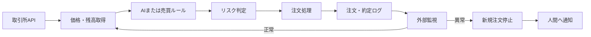

「自動トレードBotを作ったのに、自宅PCを消すと止まる」

「VPSへ移したが、再起動後も動いているか分からない」

「APIキーをサーバーへ置くのが怖い」

こうした不安を残したままBotを稼働させると、停止に気づけないだけでなく、通信エラー後の注文重複やAPIキーの漏えいによって損失が広がる恐れがあります。

この記事では、Python製のAIトレードBotをVPSへ配置し、**自動起動、ログ保存、死活監視、異常通知、安全停止まで実装する12手順**を解説します。

目標は、起動したまま放置するプログラムではありません。平常時に人間が画面を見続ける必要がなく、異常時には新規注文を止め、判断が必要なときだけ通知する「運用可能な自動化資産」です。

なお、本稿はVPSとBot運用に関する一般的な技術情報です。特定の金融商品、取引所、売買手法を推奨するものではなく、利益も保証しません。取引所の規約、居住国の法令、税務上の扱いを確認し、テスト環境または損失を許容できる範囲で検証してください。

## VPSを導入しても収益性は上がらない

VPS（Virtual Private Server）とは、インターネット上で借りる仮想サーバーです。自宅PCとは別の場所で稼働するLinuxマシンへ、SSHを使って接続し、Botを実行します。

自宅PC運用では、次のような停止要因があります。

- PCの電源断やスリープ
- OSアップデート後の再起動
- 家庭内回線やWi-Fiの障害
- ターミナルを閉じたことによるプロセス停止
- 外出中に発生したエラーの見落とし
- ログの肥大化によるディスク不足

VPSへ移すことで改善できるのは、主に**稼働時間、通信の継続性、再起動後の復旧、ログの保存**です。売買ロジックの期待値が上がるわけではありません。

利益を評価するには、売買損益だけでなく、手数料、スプレッド、スリッページ、資金調達コスト、VPS費用、税金まで別途計算する必要があります。



重要なのは、AIの判断を直接注文へ送らず、数量、損失上限、データ鮮度などを検査する独立したリスク判定層を置くことです。

## Hiro運営サイトで確認した一次情報

2026年7月23日の最終確認では、Hiroが運営する `auto-ai-blog` リポジトリ内の資料、商品設定、実行ログ、品質検査コードを確認しました。

既存資料 `generator/source_manuals/vps_setup_manual.md` は、VPS契約から `systemd` による自動起動までの**7工程**で構成されています。商品設定 `generator/products.yaml` に登録されている価格は**7,800円**で、収録項目として次の3点が記載されています。

- Ubuntu VPSの初期設定
- `screen`／`systemd`による常時稼働
- APIキー管理と少額テスト運用

7工程、7,800円、3項目という数字は、リポジトリで確認した設定値です。売上やBotの運用成績ではありません。

既存マニュアルを点検すると、実運用前に補うべき点も見つかりました。

| 確認対象 | リポジトリ内の状態 | 実運用で必要な改善 |
|---|---|---|
| 実行ユーザー | `User=root` | Bot専用の非rootユーザーへ分離 |
| 再起動設定 | `Restart=always` | 安全停止と再試行可能な障害を区別 |
| APIキー | 具体的な環境ファイル設定なし | コードとGitから分離 |
| 死活監視 | Bot外部からの監視なし | heartbeatを外部監視 |
| 注文重複 | 再実行制御の詳細なし | 一意な注文IDと処理済み記録を導入 |
| 実取引成績 | 検証可能な約定履歴なし | 収益性は確認不能 |

同日の最終チェックで、AIスロップ防止機能も実行しました。

```text
実行コマンド:
python -m pytest tests/test_validate_ai_slop.py tests/test_slop_guard.py -q

結果:
... [100%]
3件成功
終了コード: 0
```

対象記事に対するローカル検査は**10点、合格基準8点**でした。

ただし、これは記事品質を検査するプログラムと本稿の構成に対する結果です。Botの収益性や取引の安全性を証明するものではありません。

また、運営ログには、生成処理が成功した後でもGitのロックファイルやpush処理で停止した記録があります。ここから得られる教訓は、**「データを生成できたこと」と「後工程まで正常に完了したこと」は別**だという点です。

Botも同じです。売買シグナルを生成できても、注文送信、約定確認、状態保存、通知のどこかが失敗すれば、運用としては成功していません。

記事内の3点の画像は構成を理解するための概念図であり、実際のVPSや取引所から取得したスクリーンショットではありません。運用成績の証拠としては扱わないでください。

## 12ステップで作るVPS運用環境


### 1. 停止条件を先に決める

VPSを契約する前に、次の項目を決めます。

- 1注文当たりの上限
- 1日当たりの損失上限
- 最大保有数量
- 未約定注文の上限
- API通信が連続失敗した場合の扱い
- 価格データを古いと判定する時間
- Bot内部残高と取引所残高の許容差
- 人間の承認なしで再開できる障害の範囲

一時的な通信障害と、損失上限への到達は分けてください。前者は再試行できる場合がありますが、後者を自動再開すると損失が拡大しかねません。

### 2. サポート中のLTS版を選ぶ

OSは、サポート期間を確認したUbuntu LTS版を選びます。Ubuntu 24.04 LTSの標準セキュリティ保守は、2029年5月31日までと案内されています。

出典：[Ubuntu 24.04 LTS公式リリースノート](https://documentation.ubuntu.com/release-notes/24.04/)

単純な価格取得Botなら小規模プランから始め、CPU、メモリ、ディスク使用量を実測してから増強します。機械学習モデルをVPS内で動かす場合は、モデル読み込み後のピークメモリも確認してください。

### 3. 保守ユーザーとBotユーザーを分離する

rootでBotを動かし続けず、保守作業用と実行用のユーザーを分けます。

```bash
sudo adduser opsadmin
sudo usermod -aG sudo opsadmin

sudo useradd \
  --system \
  --home /opt/trading-bot \
  --shell /usr/sbin/nologin \
  tradebot
```

`opsadmin`は保守作業用、`tradebot`はBot実行専用です。

SSHのrootログインやパスワード認証を制限する場合は、新しいターミナルからSSH鍵で接続できることを確認してから変更してください。順序を逆にすると、自分もVPSへ入れなくなる可能性があります。

### 4. 更新とファイアウォールを設定する

```bash
sudo apt update
sudo apt full-upgrade -y
sudo apt install -y ufw git python3-venv
sudo ufw allow OpenSSH
sudo ufw enable
sudo ufw status verbose
```

Ubuntu公式によると、`ufw`は初期状態では無効です。

出典：[Ubuntu Serverのファイアウォール解説](https://ubuntu.com/server/docs/how-to/security/firewalls/)

VPS事業者側にもファイアウォールがある場合は、SSH接続元を限定できるか検討します。ただし、設定ミスに備えて、管理コンソールやレスキューモードなどの代替経路を先に確認してください。

### 5. Python仮想環境へBotを配置する

```bash
sudo install -d -o opsadmin -g tradebot -m 2750 \
  /opt/trading-bot/app

sudo install -d -o tradebot -g tradebot -m 750 \
  /var/lib/trading-bot

sudo install -d -o tradebot -g tradebot -m 750 \
  /var/log/trading-bot
```

Botのコードと `requirements.txt` を配置した後、仮想環境を作ります。

```bash
cd /opt/trading-bot/app
python3 -m venv .venv
.venv/bin/pip install -r requirements.txt
```

`venv`を使えば、Bot専用のPythonライブラリ環境を分離できます。

出典：[Python公式venvドキュメント](https://docs.python.org/3/library/venv.html)

本番で使用するライブラリは、価格取得だけでなく、注文、取消、残高照会まで検証したバージョンへ固定してください。

### 6. APIキーをコードとGitから分離する

```bash
sudo install -o root -g tradebot -m 640 /dev/null \
  /etc/trading-bot.env

sudoedit /etc/trading-bot.env
```

```dotenv
EXCHANGE_API_KEY=your_api_key
EXCHANGE_API_SECRET=your_secret
BOT_MODE=paper
ALLOW_NEW_ORDERS=false
```

APIキーには、可能な範囲で次の制限を付けます。

- 出金権限を付けない
- 不要な取引権限を外す
- VPSの固定IPだけを許可する
- Botごとに別のキーを発行する
- ログへ秘密情報を出力しない
- 漏えい時の失効手順を残す

最初は `ALLOW_NEW_ORDERS=false` のまま、価格取得、残高照会、ログ保存、通知だけを確認します。

### 7. 注文重複をテストする

同じ売買シグナルを2回入力し、注文候補が1件しか生成されないことを確認します。

```text
入力シグナルID: signal-20260722-001
1回目: 注文候補を1件作成
2回目: 処理済みとして拒否
生成された注文数: 1件
```

注文には一意なクライアント注文IDを付け、処理済みシグナルを永続化します。

APIタイムアウトは、注文失敗を意味するとは限りません。注文は取引所に届き、応答だけが戻らなかった可能性があります。再送する前に、クライアント注文IDを使って取引所側の注文状態を照会してください。

### 8. systemdで自動起動する

初期確認には `screen` も使えますが、無人運用では再起動制御とログ管理ができる `systemd` を使います。

```ini
# /etc/systemd/system/trading-bot.service
[Unit]
Description=AI Trading Bot
After=network-online.target
Wants=network-online.target
StartLimitIntervalSec=300
StartLimitBurst=3

[Service]
Type=simple
User=tradebot
Group=tradebot
WorkingDirectory=/opt/trading-bot/app
EnvironmentFile=/etc/trading-bot.env
ExecStart=/opt/trading-bot/app/.venv/bin/python bot.py

Restart=on-failure
RestartSec=15

NoNewPrivileges=true
PrivateTmp=true
ProtectHome=true
ProtectSystem=strict
ReadWritePaths=/var/lib/trading-bot /var/log/trading-bot
UMask=0027

[Install]
WantedBy=multi-user.target
```

設定を検証してから反映します。

```bash
sudo systemd-analyze verify \
  /etc/systemd/system/trading-bot.service

sudo systemctl daemon-reload
sudo systemctl enable --now trading-bot
sudo systemctl status trading-bot
sudo journalctl -u trading-bot -n 100 --no-pager
```

`Restart=on-failure`は一時的なプロセス障害からの復旧に使います。認証エラー、残高不一致、損失上限到達などは、自動再起動で取引を再開せず、`HALTED`状態へ移して新規注文を禁止する設計が安全です。

### 9. 停止前に状態を保存する

Botを終了するときは、次の順序で処理します。

1. 新しい売買シグナルを受け付けない
2. 送信中の注文状態を照会する
3. 未約定注文と保有ポジションを保存する
4. 新規注文停止フラグを保存する
5. 最終heartbeatを記録する
6. ログを書き出して終了する

heartbeatには、最低限、時刻、稼働モード、状態、最終データ取得時刻、Botバージョンを含めます。

```json
{
  "timestamp": "2026-07-22T12:00:00+09:00",
  "mode": "paper",
  "state": "RUNNING",
  "allow_new_orders": false,
  "last_market_data_at": "2026-07-22T11:59:58+09:00",
  "last_api_result": "ok",
  "bot_version": "1.4.2"
}
```

APIキーやシークレットは含めないでください。

### 10. Botの外から監視する

Bot自身だけに通知させると、Botと通知処理が同時に停止したときに何も届きません。別プロセスまたは外部監視サービスからheartbeatを確認します。

即時通知の対象例は次のとおりです。

- heartbeatの途絶
- API認証エラー
- 価格データの更新停止
- 残高不一致
- 日次損失上限への到達
- 短時間の連続再起動
- ディスク容量不足
- `HALTED`状態への遷移

通常の価格取得まで毎回通知すると、重要な警告が埋もれます。人間の判断が必要な異常だけを通知してください。

### 11. ログの保持上限を決める

ログを無制限に保存すると、ディスクが埋まり、Botが停止します。`journald`の上限、または `logrotate` の保存期間と容量を設定します。

注文ログには、次の情報を残します。

- 日時
- シグナルID
- クライアント注文ID
- 銘柄と売買方向
- 注文前後の残高
- API応答
- 再試行回数
- Botバージョン
- 注文可否を決めたリスク判定

1件の注文について、「どのシグナルから、どの判定を経て、どの取引所注文になったか」を追跡できる状態が理想です。

### 12. paperモードでVPSを再起動する

`BOT_MODE=paper`、`ALLOW_NEW_ORDERS=false` の状態で障害試験を行います。

```bash
sudo reboot
```

再接続後に確認します。

```bash
systemctl is-active trading-bot
systemctl is-enabled trading-bot
journalctl -u trading-bot --since "30 minutes ago"
```

合格条件は、サービスが `active` になったことだけではありません。

- heartbeatが再び更新される
- 再起動前の状態を読み込める
- 同じ注文を再生成していない
- 新規注文停止フラグが維持される
- 未約定注文を取引所と再照合している
- APIキーがログへ出ていない
- 外部監視が停止と復旧を検知できる

実資金を入れた状態で障害試験を行うのは避けてください。

## 専門家が確認すべき4つの境界


### AIの出力と注文処理を分離する

AIが売買候補を出しても、次の項目は決定的なルールで再検査します。

- 銘柄が許可リスト内か
- 数量が上限内か
- 価格データが古くないか
- 損失上限へ達していないか
- 未約定注文と重複していないか
- `ALLOW_NEW_ORDERS` が有効か

AIの文章出力をそのまま注文パラメーターとして使わないでください。

### 再起動成功と取引再開を分ける

プロセスの自動再起動は、取引の自動再開を意味しません。

VPS再起動後は、残高、未約定注文、ポジション、最終処理済みシグナルを再照合し、安全性を確認してから新規注文を許可します。

### Bot内部の損益と取引所明細を突合する

Botが表示する損益だけでは、手数料や資金調達コストが抜ける場合があります。

日次または週次で、Botの注文記録、取引所の約定履歴、残高推移を突合してください。差額が出た場合は、新規注文を止めて原因を調査します。

### 収益性と運用品質を分ける

稼働率が高くても、損失が続くBotは成功ではありません。一方、利益が出た期間があっても、注文重複やログ欠損があるBotは安全に拡大できません。

評価軸を分けてください。

| 分類 | 主なKPI |
|---|---|
| 稼働品質 | 稼働率、heartbeat遅延、APIエラー率 |
| 注文品質 | 重複注文数、不明注文数、残高不一致 |
| 復旧品質 | 平均復旧時間、連続再起動数 |
| 人間作業 | 手動介入回数、確認時間 |
| 収益性 | 手数料・VPS費用控除後損益、最大ドローダウン |

特に重複注文数は0件を目標にします。

## よくある失敗と改善策

| 失敗 | 原因 | 改善策 |
|---|---|---|
| SSHを切ると停止する | ターミナルから直接起動 | 検証は `screen`、運用は `systemd` |
| 再起動後に動かない | `enable`忘れ、パス間違い | VPS再起動試験を実施 |
| APIキーが漏れる | コードやGitへ直書き | 環境ファイルと権限制限を使用 |
| 注文が重複する | タイムアウトを失敗と断定 | 再送前に注文状態を照会 |
| 再起動を繰り返す | 認証・設定エラー | 再起動回数を制限 |
| 安全停止後に再開する | 全障害を同じ終了処理にしている | 再試行可能な障害と安全停止を分離 |
| ディスクが埋まる | ログ保存が無制限 | 保存期間と容量上限を設定 |
| 利益が過大に見える | コスト未計上 | 取引所明細と突合 |
| 停止通知が来ない | Bot内の通知処理も停止 | 外部からheartbeatを監視 |

## 完全自動化が適さないケース

次のいずれかに当てはまる場合は、実注文の自動化を急がないでください。

- 売買ルールを言語化できない
- バックテストとフォワードテストを行っていない
- APIキーの権限管理ができない
- 取引所明細とBotログを突合できない
- 損失上限と停止条件を決めていない
- 障害時に対応する担当者がいない
- 税務や取引所規約を確認していない
- 失って困る資金を使う予定がある

取引頻度が低い場合は、完全自動注文よりも、価格監視と通知だけを自動化し、注文は人間が承認する構成のほうが費用対効果に優れることもあります。

## 今日からできる30分の作業

まだVPSを契約していない人は、次の5項目を書き出してください。

```text
1注文当たりの上限:
1日当たりの損失上限:
APIキーに付ける権限:
異常通知の送信先:
Botを停止する条件:
```

すでにBotがある場合は、次の順番で検証します。

1. `ALLOW_NEW_ORDERS=false` で価格取得と残高照会を確認する
2. 同じシグナルを2回入力し、注文候補が1件になることを確認する
3. API通信を意図的に失敗させ、安全停止を確認する
4. paperモードのままVPSを再起動する
5. heartbeat、ログ、外部通知を確認する
6. 日時、Botバージョン、入力ID、結果を保存する
7. 証拠をレビューしてから、少額試験へ進むか判断する

最初の目標を「利益を出すこと」にすると、安全確認を飛ばしやすくなります。まずは**注文を許可しない状態で、24時間の監視と障害復旧を確認すること**を目標にしてください。

## まとめ：完全無人ではなく、異常時だけ介入する仕組みへ

VPS上でプロセスが動いているだけでは、運用可能な自動化資産にはなりません。

必要なのは、次の設計です。

- Botをroot以外のユーザーで動かす
- APIキーをコードとGitから分離する
- 注文処理を冪等にする
- 再試行可能な障害と安全停止を分ける
- 異常時には新規注文を禁止する
- Botの外からheartbeatを監視する
- 再起動と通信障害をpaperモードで試験する
- 稼働品質、収益、人間の介在時間を分けて測る

「完全無人」とは、監視しなくてよい状態ではありません。

平常時の確認作業を減らし、異常時には安全側へ止まり、改善に使えるデータを残すことです。そこまで設計して初めて、Botは時間を消耗する実験から、繰り返し改善できる自動化資産へ近づきます。

## 本気で自動化・不労所得を構築したい方へ

VPS契約、SSH、Python環境、`systemd`、APIキー、監視、障害試験を断片的な記事から拾い集めると、設定漏れを見つけるだけで何日も費やすことがあります。

目指しているのが、単にBotを起動することではなく、**眠っている間も処理を続け、異常時には資金を守る側へ止まり、翌朝には改善データが残る仕組み**なら、構築順序と検証項目を最初からそろえてください。

商品一覧ページでは、AIトレードBotのVPS環境構築をはじめ、AI集客、コンテンツ販売、アフィリエイトなど、労働時間への依存を減らすための実践マニュアルを公開しています。

**手作業を積み上げる毎日から、自動化資産を育てる毎日へ移りたい方は、次の一歩をこちらから始めてください。**

[本気で自動化・不労所得を構築したい方向けの実践マニュアルを見る](/products/)
