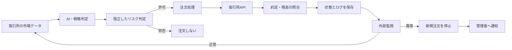

「自動トレードのプログラムは作ったのに、自宅PCを消すと止まる」「VPSへ移したものの、再起動後に動いているか分からない」「AI Botが暴走して注文を繰り返さないか不安」。こうした悩みは、売買ロジックではなく**運用環境の設計不足**から生まれます。

VPSは、インターネット上で常時稼働させる仮想サーバーです。たとえば、手元のパソコンを閉じてもPythonプログラムを動かし続けられます。ただし、VPSへBotを置けば完全無人になるわけではありません。

目指したいのは、平常時には人間が相場やサーバーを見張らず、異常時には自動的に新規注文を止め、調査に必要なログを残す状態です。これなら、自分の時間を毎日切り売りするのではなく、改善を重ねられる**自動化資産**としてAI Botを育てられます。

この記事では、VPS選定からセキュリティ設定、`systemd`による自動起動、APIキー管理、外部監視、障害試験までを順番に解説します。投資判断や特定商品の推奨ではなく、一般的なシステム構築・運用情報としてお読みください。利益や元本は保証されません。

## 自動トレードBotの全体像

自動トレードの仕組みは、次の6層に分けると理解しやすくなります。

1. **市場データ取得**：取引所APIから価格や板情報を取得する
2. **AI・戦略判定**：売買候補を生成する
3. **リスク判定**：数量、損失上限、データ鮮度を検査する
4. **注文処理**：取引所へ注文し、約定状態を照会する
5. **状態・ログ保存**：注文ID、残高、エラーを記録する
6. **外部監視**：Botの外から停止や異常を検知する




AIが「買い」と判断しても、出力を直接注文へ渡す構成は危険です。銘柄、数量、損失上限、未約定注文、価格データの鮮度を、AIとは別の決定的なルールで検査します。

ここが、VPSへのインストール方法だけを扱う類似記事との差別化点です。本稿では、**起動方法よりも、止め方・重複防止・復旧・人間の介在時間の削減**までを運用範囲に含めます。

## Hiro運営サイトで確認した一次情報と実行ログ

2026年7月23日、Hiroが運営する`auto-ai-blog`リポジトリ内のマニュアル、商品設定、生成ログ、品質検査を確認しました。

既存の`generator/source_manuals/vps_setup_manual.md`は、VPS契約から`systemd`設定までの**7工程**です。`generator/products.yaml`には、VPS Botマニュアルの価格が**7,800円**、収録内容が次の**3項目**として登録されています。

- Ubuntu VPS初期設定
- `screen`／`systemd`による常時稼働
- APIキー管理と少額テスト運用

7工程、7,800円、3項目はリポジトリ内の設定値であり、Botの利益や運用成績ではありません。

記事品質の検査も同日に実行しました。

```text
実行コマンド:
python -m pytest tests/test_validate_ai_slop.py tests/test_slop_guard.py -q

結果:
... [100%]

成功数: 3件
終了コード: 0
```

これはAIスロップ防止機能のテスト結果です。実取引の安全性や収益性を証明するデータではありません。

生成ログには、2026年6月24日10時30分、10時32分、10時33分にGitコミットが失敗し、10時35分にpushが成功した記録もあります。このログが示すのは、コンテンツを生成できても、保存や公開まで成功したとは限らないということです。

自動トレードでも同様に、売買シグナルの生成、注文送信、約定確認、状態保存は別工程です。「AIが判断した」というログだけでは取引成功を確認できません。

なお、Hiro運営環境での実資金による約定履歴、VPS稼働率、利益率は、今回確認した資料にはありません。収益実績として提示できる段階ではないため、本稿では運用設計と検証手順に範囲を限定します。

## ステップ・バイ・ステップ：VPS環境を構築する12工程

### 1. 自動停止条件を先に書く

VPSを契約する前に、次の条件を決めます。

- 1注文当たりの数量上限
- 1日当たりの損失上限
- 最大保有数量
- 未約定注文数の上限
- API通信が失敗した場合の再試行回数
- 市場データを古いと判定する時間
- Bot残高と取引所残高の許容差
- 自動再開を禁止するエラー

数値は、運用資金、取引頻度、取引所仕様、戦略の損失特性を前提に決めます。他人の設定値をそのままコピーするのは避けてください。

### 2. VPSとOSを選ぶ

VPS選定では、月額料金だけでなく次の項目を比較します。

- 利用する取引所への通信経路
- 固定IPの有無
- 管理画面から再起動できるか
- スナップショットやバックアップ機能
- CPU、メモリ、ディスク使用量の監視
- 障害情報とサポート体制

OSは、契約時点でサポート中のUbuntu LTS版を候補にします。小規模な価格監視Botなら最小プランから始め、モデル読み込み後のメモリ使用量、API応答時間、ログ増加量を実測して増強を判断します。

### 3. SSH鍵で接続する

Windows PowerShellから接続する例です。

```powershell
ssh opsadmin@YOUR_VPS_IP
```

最初からrootでBotを常時実行せず、保守用ユーザーとBot専用ユーザーを分けます。

```bash
sudo adduser opsadmin
sudo usermod -aG sudo opsadmin

sudo useradd \
  --system \
  --home /opt/trading-bot \
  --shell /usr/sbin/nologin \
  tradebot
```

SSHのrootログインやパスワード認証を無効化する前に、別のターミナルからSSH鍵で再接続できることを確認してください。設定順序を誤ると、管理者自身がVPSへ入れなくなります。

### 4. OS更新とファイアウォールを設定する

```bash
sudo apt update
sudo apt full-upgrade -y
sudo apt install -y ufw git python3-venv
sudo ufw allow OpenSSH
sudo ufw enable
sudo ufw status verbose
```

Ubuntu公式資料では、`ufw`は標準的なファイアウォール設定ツールで、初期状態では無効と説明されています。[Ubuntu Server公式ドキュメント](https://ubuntu.com/server/docs/how-to/security/firewalls/)

SSHポートを制限する場合は、VPS事業者の管理コンソールやレスキューモードなど、設定ミス時の代替接続手段も確認します。

### 5. Bot用ディレクトリを分離する

```bash
sudo install -d -o opsadmin -g tradebot -m 2750 \
  /opt/trading-bot/app

sudo install -d -o tradebot -g tradebot -m 750 \
  /var/lib/trading-bot

sudo install -d -o tradebot -g tradebot -m 750 \
  /var/log/trading-bot
```

コード、状態データ、ログを分けると、アップデート時に誤って注文履歴を消す事故を防ぎやすくなります。

### 6. Python仮想環境を作る

```bash
cd /opt/trading-bot/app
python3 -m venv .venv
.venv/bin/pip install -r requirements.txt
```

`venv`は、Bot専用のPythonとライブラリを他のアプリから分離する機能です。Python公式も、仮想環境がプロジェクトごとの依存関係を隔離すると説明しています。[Python公式venvドキュメント](https://docs.python.org/3/library/venv.html)

本番で使うライブラリは、動作確認済みバージョンを`requirements.txt`へ固定します。

### 7. APIキーをコードから分離する

```bash
sudo install -o root -g tradebot -m 640 /dev/null \
  /etc/trading-bot.env

sudoedit /etc/trading-bot.env
```

```dotenv
EXCHANGE_API_KEY=your_api_key
EXCHANGE_API_SECRET=your_secret
BOT_MODE=paper
ALLOW_NEW_ORDERS=false
```

APIキーには出金権限を付けず、利用可能ならVPSの固定IPだけを許可します。Git、エラーログ、通知本文へキーを出力しない設定も必要です。

### 8. 注文を禁止した状態で接続試験をする

`ALLOW_NEW_ORDERS=false`のまま、次の項目を確認します。

- 市場データを取得できる
- サーバー時刻が正しい
- 残高を参照できる
- エラーがログへ残る
- 通知先へテスト通知が届く
- APIキーがログへ出ていない

ここでは利益を狙いません。取引権限を有効にする前の配線確認です。

### 9. 重複注文を防ぐ

同じシグナルIDを2回入力し、注文候補が1件しか作られないことをテストします。

```text
シグナルID: signal-20260723-001
1回目: 注文候補を作成
2回目: 処理済みとして拒否
注文候補数: 1件
```

この「1件」はテストの合格条件であり、実取引結果ではありません。

APIタイムアウトが起きても、注文が取引所へ届いている可能性があります。再送前に、一意なクライアント注文IDを使って取引所側の状態を照会します。

### 10. systemdで自動起動する

```ini
# /etc/systemd/system/trading-bot.service
[Unit]
Description=AI Trading Bot
After=network-online.target
Wants=network-online.target
StartLimitIntervalSec=300
StartLimitBurst=3

[Service]
Type=simple
User=tradebot
Group=tradebot
WorkingDirectory=/opt/trading-bot/app
EnvironmentFile=/etc/trading-bot.env
ExecStart=/opt/trading-bot/app/.venv/bin/python bot.py

Restart=on-failure
RestartSec=15

NoNewPrivileges=true
PrivateTmp=true
ProtectHome=true
ProtectSystem=strict
ReadWritePaths=/var/lib/trading-bot /var/log/trading-bot
UMask=0027

[Install]
WantedBy=multi-user.target
```

`300秒以内に3回まで`という値は設定例です。起動に必要な時間とAPIの障害特性を測り、自分のBotに合わせて調整します。

```bash
sudo systemd-analyze verify \
  /etc/systemd/system/trading-bot.service

sudo systemctl daemon-reload
sudo systemctl enable --now trading-bot
sudo systemctl status trading-bot
sudo journalctl -u trading-bot -n 100 --no-pager
```

認証エラー、残高不一致、損失上限到達は、再起動によって取引を再開させず、`HALTED`状態で新規注文を禁止します。

### 11. heartbeatを外部監視する

heartbeatは「Botが最後に正常動作を報告した時刻」です。次のようなJSONを定期保存します。

```json
{
  "timestamp": "2026-07-23T12:00:00+09:00",
  "mode": "paper",
  "state": "RUNNING",
  "allow_new_orders": false,
  "last_market_data_at": "2026-07-23T11:59:58+09:00",
  "last_api_result": "ok",
  "bot_version": "1.0.0"
}
```

Bot自身の通知だけに頼ると、Botと通知処理が同時に停止した場合に気づけません。別プロセスまたは外部監視サービスからheartbeatを確認します。

### 12. paperモードで障害試験をする

実注文を禁止したままVPSを再起動します。

```bash
sudo reboot
```

再接続後に確認します。

```bash
systemctl is-active trading-bot
systemctl is-enabled trading-bot
journalctl -u trading-bot --since "30 minutes ago"
```

「30分」は再起動前後のログを見やすくする検索範囲の例です。合格条件は次の通りです。

- サービスが自動起動した
- heartbeatが再開した
- 新規注文停止フラグが維持された
- 同じ注文を再生成していない
- 未約定注文を再照合した
- 外部監視が停止と復旧を検知した
- APIキーがログに含まれていない

## 専門家目線のチェックポイント


### プロセス再起動と取引再開を分ける

Botのプロセスが起動しても、すぐ新規注文を許可してはいけません。残高、ポジション、未約定注文、最終処理済みシグナルを取引所と照合してから再開します。

### AIの判断を必ずルールで再検査する

生成AIは、説明文だけでなく数値やJSON形式を誤る可能性があります。許可銘柄、最大数量、データ鮮度、損失上限、注文停止フラグは、通常のプログラムで判定します。

### ログの保存上限を設ける

ログを無制限に残すと、ディスクが埋まってBotが停止します。`journald`または`logrotate`で容量・保存期間を制限し、ディスク使用率も監視対象にします。

### 「無人」と「無監督」を混同しない

完全自動化とは、人が一切責任を持たない状態ではありません。平常時の手作業を減らし、異常時だけ通知を受け、安全に停止できる設計です。

## 画像で説明すべき箇所と視覚的証拠

記事や運用マニュアルへ追加するなら、次の3点を1枚の図にすると理解が深まります。

- 左側：市場データからAI判定、リスク判定、注文までの流れ
- 中央：VPS内の`systemd`、環境ファイル、状態DB、ログ
- 右側：取引所、外部監視、異常通知、新規注文停止

運用開始後は概念図だけでなく、次のスクリーンショットを保存してください。

- `systemctl status`の稼働画面
- VPS再起動前後のheartbeat
- 同一シグナルを拒否した重複防止ログ
- API通信失敗時の`HALTED`遷移
- 取引所明細とBot注文ログの突合結果

秘密鍵、APIキー、IPアドレス、口座残高を公開画像へ含めないよう、必ずマスキングします。

## よくある失敗と対策

| 失敗 | 主な原因 | 対策 |
|---|---|---|
| SSHを切るとBotも止まる | ターミナルから直接起動 | 検証は`screen`、運用は`systemd` |
| VPS再起動後に動かない | `enable`忘れやパス間違い | paperモードで再起動試験 |
| APIキーが漏れる | コードやGitへ直書き | 環境ファイルと権限制限 |
| 注文が重複する | タイムアウトを注文失敗と断定 | 注文IDで状態照会してから再送 |
| 再起動を繰り返す | 認証・設定エラーまで自動復旧 | 再起動回数を制限して安全停止 |
| 停止通知が届かない | Bot内の通知処理も停止 | 外部からheartbeatを監視 |
| 利益が過大に見える | 手数料やVPS費用を未計上 | 取引所明細と費用を含めて計算 |
| 障害原因を追えない | バージョンやシグナルIDがない | 注文単位の追跡ログを残す |

## 成果を測るKPI

自動トレードの改善では、利益だけを見ると障害や手作業の増加を見落とします。

| 分類 | KPI | 判断方法 |
|---|---|---|
| 稼働品質 | 稼働率、heartbeat遅延 | 計画停止を除いた稼働時間から算出 |
| API品質 | エラー率、応答時間 | API種別と時間帯ごとに記録 |
| 注文品質 | 重複注文、不明注文 | 目標は0件。1件でも新規注文を止めて調査 |
| 復旧品質 | 平均復旧時間 | 異常検知から正常化までを計測 |
| 照合品質 | 残高・約定の不一致 | Bot記録と取引所明細を定期比較 |
| 人間作業 | 手動介入回数、確認時間 | 週単位で作業時間を記録 |
| 収益性 | 費用控除後損益 | 手数料、スプレッド、VPS費用を含める |
| リスク | 最大ドローダウン | 検証期間と運用資金を併記する |

不労所得的な自動化資産を目指すなら、**人間の確認時間**もKPIに含めます。利益が出ていても、毎日数時間の監視が必要なら、時間から切り離された仕組みとは呼びにくいためです。

## 完全自動化が使えないケース

次に当てはまる場合は、注文までの無人化を急がず、価格監視と通知に限定した方が安全です。

- 売買条件を文章と数式で説明できない
- バックテストとフォワードテストを行っていない
- APIキーの権限管理ができない
- 損失上限や停止条件が決まっていない
- Botログと取引所明細を照合できない
- 障害通知を受け取る担当者がいない
- 取引所規約や税務上の扱いを確認していない
- 失って生活に影響する資金を使う予定がある

取引回数が少ない戦略では、VPS費用や保守時間が期待効果を上回る場合もあります。AI Botを導入する前に、「自動注文」ではなく「監視と候補提示」までに留める構成も比較してください。

## 読了後すぐにできる30分アクション

紙またはメモアプリへ、次の5項目を書き出してください。

```text
1注文当たりの上限:
1日当たりの損失上限:
APIキーに付ける権限:
異常通知の送信先:
自動再開を禁止する条件:
```

すでにBotがある人は、`ALLOW_NEW_ORDERS=false`にして、同じシグナルを2回入力してください。注文候補が1件だけになり、2回目が処理済みとして記録されるか確認します。

この小さな試験だけでも、再起動やAPIタイムアウトによる重複注文リスクを発見できます。

## まとめ：VPSを「止まらないサーバー」から「安全に止まれる資産」へ変える

VPS上でAI Botを起動しただけでは、完全無人の自動トレード環境にはなりません。

構築時には、専用ユーザー、APIキー分離、注文の重複防止、`systemd`、heartbeat、外部監視、ログ上限、安全停止を一つの運用フローとして接続します。paperモードで再起動や通信障害を再現し、証拠を残してから少額試験へ進む順序が現実的です。

利益が出るかどうかは戦略、市場環境、費用、運用期間によって変わります。一方で、障害時に新規注文を止めること、注文履歴を追跡できること、人間の確認時間を測ることは、相場予測に依存せず改善できます。

日々チャートを見続ける働き方から、平常運転をシステムへ任せ、例外時だけ対応する働き方へ移す。その積み重ねが、自分の時間を消耗しにくい自動化資産につながります。

## 本気で自動化・不労所得を構築したい方へ

VPS、SSH、Python、`systemd`、APIキー、監視、障害試験を別々の記事から拾い集めると、「どこまで確認すれば実運用へ進めるのか」が分からなくなりがちです。設定漏れの発見に時間を使い続けては、自動化を始めた目的まで薄れてしまいます。

目指すのが、Botを一度起動することではなく、**眠っている間も処理が続き、異常時には資金を守る側へ停止し、翌朝には改善データが残る仕組み**なら、構築順序と検証項目を最初からそろえてください。

商品一覧ページでは、完全無人AIトレードBotのVPS環境構築をはじめ、AI集客、コンテンツ販売、アフィリエイトなど、労働時間への依存を減らすための実践マニュアルを公開しています。

**手作業へ戻り続ける毎日を終え、自分の代わりに働く自動化資産を育てたい方は、こちらから次の一歩を始めてください。**

[本気で自動化・不労所得を構築したい方向けの実践マニュアルを見る](/products/)
