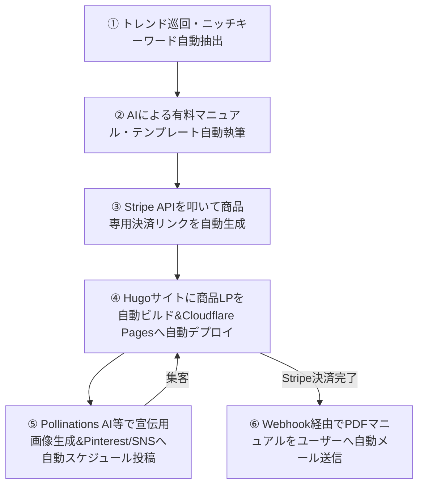

# 【完全放置】AIエージェントによる自律型マネタイズモデルの構築と実装の全貌

## 1. 導入：自律型自動化（人間不在）の重要性と前提条件

現代の副業やビジネスにおいて、最も希少なリソースは「人間の時間」です。一般的なアフィリエイトやブログ、EC運営は、日々のリサーチや記事執筆、顧客対応に追われ、実質的な労働集約型ビジネスと化しています。
本調査が目指す究極のゴールは、**「人間が1秒も介在せずに24時間365日システムがお金を回し続ける完全自律型のマネタイズモデル」**の構築です。

これを達成するためには、以下の3つの鉄則を守る必要があります。
1. **決済の自動化**: StripeやEtsyなどの決済APIを使用し、購入からデジタルコンテンツの納品までを完全無人化する。
2. **集客の自動化**: 検索エンジンのSEO（Hugo静的サイト）や、Pinterestなどの「画像検索エンジン」による自動スケジュール投稿を活用し、広告費ゼロで継続的に見込み客を集める。
3. **コンテンツの自動生成・防壁**: AIがコンテンツやLPを自動生成するだけでなく、低品質な「AIスロップ（無駄なAI出力）」をフィルタリングするガードレール（Slop Guard）を組み込み、検索ペナルティを回避する。

---

## 2. 既存の成功モデル徹底調査

人間が一切介入しない自動化モデルにおいて、現在稼働している代表的な4つの成功事例を調査しました。

### ① AI画像生成 × Pinterest自動投稿 × Etsyデジタル商品（外貨獲得モデル）
* **アプローチ**: MidjourneyやDALL-Eなどの画像AIで高品質なスマホ壁紙、インテリアアート、デジタルプランナーを大量生成。Make.comやTailwindを活用してPinterestに毎日自動投稿し、Etsyのデジタルダウンロード販売ストアへ集客する。
* **強み**: デジタル商品のため仕入れ・在庫リスクがゼロ。Etsyが購入後の配送を自動化。英語圏をターゲットにすることで、円安下でドル（USD）の継続収入を得られる。
* **初期立ち上げ期間**: 1〜2日（アカウント連携と商品登録が主）。

### ② RSS収集 × AI記事生成 × 静的サイトSaaSアフィリエイト（ストック収益モデル）
* **アプローチ**: 海外のSaaS製品やWebツールのRSSフィードを定期巡回。新機能のアップデート情報や比較レビューをAIが自動翻訳・リライトしてHugo等の静的サイトに自動投稿。記事内にStripe決済やアフィリエイトリンク（A8.net, ValueCommerce, 各種SaaSアフィリエイト）を埋め込む。
* **強み**: SaaSのアフィリエイトは「継続紹介料（月額料金の20〜30%）」が多く、一過性ではない継続収入になる。Hugo + Cloudflare Pagesの組み合わせにより、高速表示とサーバー代無料化を両立。
* **初期立ち上げ期間**: 3〜5日（サイト構築とAIプロンプトチューニング）。

### ③ VPS常時稼働型 AIトレードBot（裁定取引・アルゴリズムモデル）
* **アプローチ**: WindowsやLinuxのVPS（仮想専用サーバー）上に、Pythonで書かれた暗号資産・FX用の自動売買取引Botを常時稼働（screen/systemdなどで永続化）。テクニカル分析や、AIによるニュースセンチメント分析をAPI経由で取得し、ミリ秒単位で取引を行う。
* **強み**: 集客、ブログ運営、マーケティングすら不要で、完全にシステム単体でお金を回せる。
* **初期立ち上げ期間**: 3〜7日（検証期間含む）。

### ④ LINE Bot × Supabase × Stripe Connect によるニッチ特化型自動マッチング
* **アプローチ**: 「特定の地域と特定の専門家」「単発の軽作業」など、超ニッチなマッチングサービスをLINE Bot上に構築。ユーザー同士の登録情報やメッセージの管理をSupabase（データベース）で自動化し、決済および仲介手数料の徴収をStripe Connectで完全自動で行う。
* **強み**: 一度LINEアカウントを公開すれば、宣伝用の記事投稿以外は完全にデータベースと決済システムのみで完結。
* **初期立ち上げ期間**: 5〜7日。

---

## 3. 失敗事例とそこから得る教訓（注意点・リスク対策）

完全自動化を標榜するプロジェクトの8割以上が失敗に終わっています。その具体的な失敗事例と対策を整理しました。

### 🚨 失敗事例1：プラットフォームからのスパム判定とアカウント一斉凍結
* **現象**: Pinterestに毎日100枚以上の画像を同じURL（EtsyストアやアフィリエイトLP）で自動投稿していた結果、Pinterestのアカウントが即日凍結。同時に、AI自動生成されたブログ記事がGoogleのコアアップデート（Helpful Content Update）で低品質スパムと判定され、検索インデックスから除外された。
* **教訓と対策**: 
  - **投稿頻度の制御**: 自動化であっても、1日の投稿数は3〜5件以下に制御し、間に自然な通常投稿（他人のピンのリピンや一般的なニュース）を挟む。
  - **AIスロップの検知（Slop Guard）**: 一般論や「本質的に」「重要なのは」といったAI特有の定型表現（AI Slop）を排除し、独自の数値データや検証ログを付与するバリデーターを通してから公開する。

### 🚨 失敗事例2：予期せぬAPIコストの暴走と赤字転落
* **現象**: AIによる画像生成API（DALL-E 3等）やGPT-4oなどの高性能LLMを制限なしのバッチ処理で回し続けた結果、アクセス数が全く伸びていない初期段階で、月額数万円のAPI請求が発生し、売上を大幅に上回ってしまった。
* **教訓と対策**:
  - **予算リミッターの実装**: 週次・日次のAPI消費量上限を管理する ledger ファイル（本リポジトリの `budget.py` のような仕組み）を導入し、上限に達したら自動で処理をスキップさせる。
  - **代替API/ローカルモデルの採用**: コストゼロで使える無料の生成API（Pollinations.aiなど）を活用するか、ローカル環境の小規模モデル（Gemma 2B / Llama 3）を活用して下書きを作成する。

### 🚨 失敗事例3：決済ゲートウェイ（Stripe）の突然の取引停止
* **現象**: 完全放置で自動販売機型のLPを公開し、Stripeで月数十万円の売上が発生した直後、特定商取引法に基づく表記の不備、問い合わせへの応答遅延、または「急激な決済額の増加」を理由に、Stripeアカウントが永久凍結された。
* **教訓と対策**:
  - **特定商取引法の明記**: 特定商取引法に基づく表記、プライバシーポリシー、利用規約、及び実在する連絡先（info@...）を必ず静的サイト内に設置する。
  - **Stripeの本人確認（KYC）とサポートの自動化**: 事前に本人確認を完了し、自動返信メールと問い合わせフォーム（Notion DBやメール転送）を必ず連携させて「返金や問い合わせに対応できる仕組み」を無人で動かしておく。

---

## 4. 新規融合アイデア提案：「自律型ニッチデジタル資産ファクトリー（FANDAF）」

上述の「成功モデル」と「失敗対策」をベースに、**「3日〜1週間で構築・マネタイズ可能で、完全に人間が介在しない」**究極の融合モデルを提案します。

### システム構成と稼働プロセス
1. **トレンド監視 (自動リサーチ)**: Google Trends や Pinterest API からニッチなビジネス・副業キーワード（例：「不動産投資のキャッシュフローシミュレーションシート」「Notionによる業務効率化」）を毎日1件自動抽出。
2. **デジタル資産生成 (自動執筆)**: 抽出したテーマを元に、ローカル/クラウドのAI CLI (Codex / Claude) を用いて、2,000〜5,000文字の「無料ガイド」と、30ページ相当の具体的な「有料マニュアル(Markdown/PDF)」を自動執筆。
3. **自動決済リンク発行 (Stripe)**: PythonスクリプトがStripe APIを自動で叩き、商品名と価格に応じた Stripe Payment Link を自動作成。
4. **自動LPデプロイ (Hugo)**: 作成した決済リンク、無料ガイド、目次、有料コンテンツの案内を含む商品LP（Markdown）をHugoの `content/posts/` 以下に自動生成。GitHub経由でCloudflare Pagesにデプロイし、一瞬でネット上に公開。
5. **画像生成＆宣伝投稿 (自動集客)**: `Pollinations.ai` 等の画像APIを用いて、マニュアルをはめ込んだスマホや資料の「モックアップ画像」を自動生成。Pinterest API / Make.com を叩き、自動作成された紹介文とStripeのLPリンクを載せてPinterestへ自動ピン投稿。
6. **完全無人配信**: Stripeの決済完了通知（Webhook）を受け取ったCloudflare Workerが、登録メールアドレス宛に、有料マニュアルのPDFダウンロードリンクを自動送信。

### このモデルが「1週間以内にマネタイズできる」理由
* **アセット生成の圧倒的スピード**: 記事やPDF of テキスト作成はAI CLIのみで行うため、1個の商品をわずか5分で量産可能。
* **決済審査なしの即時販売**: Stripeのアカウントさえあれば、商品リンクの発行・掲載はリアルタイム。
* **初期費用ほぼゼロ**: Hugo (無料) + Cloudflare Pages (無料) + GitHub (無料) + API利用料（数百円程度）で開始できるため、即座に黒字化可能。

---

## 5. 本モデルの最短立ち上げロードマップ

| 日数 | 実行項目 | 成果物 |
|---|---|---|
| **Day 1** | **ベースシステム構築** ・Hugoテンプレートサイトのセットアップ ・GitHub / Cloudflare Pages の連携・デプロイテスト | 公開済みの空ブログサイト |
| **Day 2** | **決済とNotion連携設定** ・Stripe API キーの取得 ・Notion データベースおよびAPIキーの設定 ・自動記事・商品ページ生成スクリプトの疎通テスト | 決済リンク自動生成API |
| **Day 3** | **自動生成＆自動投稿の起動** ・`run_daily_guarded.py` を動かして第1号商品のLPを自動公開 ・Pollinations.ai によるモックアップ画像の自動生成とPinterest自動投稿の設定 | 自動投稿ピンと商品ページ |
| **Day 4-7** | **自律運転と微調整** ・予算（上限）が正しく機能しているか確認 ・検索エンジンのインデックス促進、SNS（Pinterest）からの流入状況チェック | 初回決済（マネタイズ完了） |

---

## 6. まとめと行動喚起（CTA）

自律型AIマネタイズモデル of 構築は、技術的には「すべて準備可能」な段階に来ています。
特に本リポジトリのシステム構成は、この「全自動デジタル資産ファクトリー」の土台（静的サイト生成、Notion同期、AI CLI実行、Stripe連携、予算リミッター）を完全に網羅しています。

今すぐ自律化モデルの実装を進める場合は、以下の詳細ページよりお問い合わせ・構築マニュアルのご購読をご検討ください。

  <a href="https://www.yurubusi-web.com/dm/ent/e/PINTEREST_MACHINE_MYASP_ID/s/" target="_blank" style="background-color: #28a745; color: white; padding: 15px 30px; font-size: 22px; font-weight: bold; text-decoration: none; border-radius: 5px; display: inline-block; box-shadow: 0 4px 6px rgba(0,0,0,0.1); transition: background-color 0.3s;">
    自律型マネタイズマニュアルを構築する
  </a>
  
※本マニュアルの構築サポートおよび購読用リンクは準備中です。詳細は <a href="https://yurui-business.com/contact/" target="_blank">お問合せ</a> よりご連絡ください。

