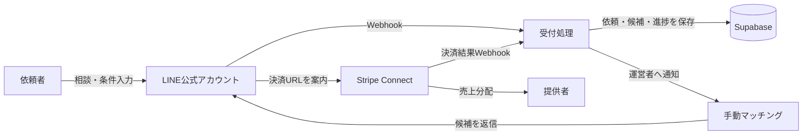

「LINEで依頼を受け、専門家を紹介し、決済時に手数料を得る」

この仕組みは、清掃、修理、ペットケア、士業相談、地域レッスンなど、対象者が少ない超ニッチ市場と相性があります。しかし、LINE Botや決済機能を先に作っても、依頼者と提供者が集まらなければ売上にはなりません。

最初に検証すべきなのは、システムが動くかではなく、次の3点です。

1. 本当に困っている人がいるか
2. 条件に合う提供者を確保できるか
3. 紹介後に実際の支払いが発生するか

本稿では、LINE、Stripe Connect、Supabaseを使った最小構成と、事業性を判断するための「7イベント」を解説します。

なお、ここで示す数値は運営実績ではなく、検証時に設定する基準値の例です。架空の成功事例を紹介するのではなく、自分の市場で一次データを集める方法に焦点を当てます。

## なぜ超ニッチ市場では「アプリ」よりLINEなのか

ニッチなサービスでは、専用アプリを開発しても、利用頻度が低く、インストールされないことがあります。

一方、LINE公式アカウントなら、利用者は普段使っている画面から相談できます。運営者も初期段階では、すべてを自動化せず、チャットを見ながら手作業で条件を整理できます。

重要なのは、LINEを単なる集客チャネルではなく、需要を観測するセンサーとして使うことです。

たとえば、依頼者との会話から次の情報を取得します。

- 何に困っているか
- いつまでに解決したいか
- 対応エリアはどこか
- 予算はいくらか
- 過去にどの手段を試したか
- なぜ既存サービスでは解決できなかったか

LINE Messaging APIでは、友だち追加やメッセージ送信などを契機に、登録したWebhook URLへイベントが送信されます。Webhookは外部からもアクセスできるため、処理前に署名を検証する必要があります。また、重複配信に備えて`webhookEventId`を保存し、同じイベントを二重処理しない設計が必要です。[LINE公式ドキュメント「Webhookを受信する」](https://developers.line.biz/en/docs/messaging-api/receiving-messages/)

## 最小構成は「会話・記録・決済」の3層に分ける

最初から検索、予約、レビュー、チャット、決済、管理画面をすべて開発する必要はありません。検証段階では、役割を次の3層に分ければ十分です。



### LINE：依頼の入口

LINEでは、利用者に自由文だけを送らせるのではなく、質問を一つずつ提示します。

初回受付なら、次の順番が現実的です。

1. 依頼内容
2. 希望日時
3. エリア
4. 予算
5. 連絡可能な時間帯
6. 注意事項への同意
7. 送信前の確認

すべてを自然言語処理に任せる必要はありません。日時やエリアなど、集計したい項目はボタンや選択肢で取得し、補足だけを自由入力にするとデータが崩れにくくなります。

### Supabase：検証記録の保存先

Supabaseには、最低限、次のテーブルを用意します。

| テーブル | 保存する情報 |
|---|---|
| `users` | LINEユーザーと内部ユーザーの対応 |
| `requests` | 依頼内容、地域、希望日時、予算、状態 |
| `providers` | 提供者、対応地域、カテゴリ、審査状態 |
| `matches` | 依頼と提供者の組み合わせ、提示日時、結果 |
| `payments` | Stripeの決済ID、金額、手数料、決済状態 |
| `events` | 7イベントの発生日時と関連ID |

外部公開されるスキーマではRow Level Securityを有効にし、利用者が他人の依頼を閲覧できないようにします。Supabaseは、公開スキーマ上のテーブルでRLSを有効にすることを推奨しています。[Supabase公式ドキュメント「Row Level Security」](https://supabase.com/docs/guides/database/postgres/row-level-security)

`service_role`キーはRLSを迂回できるため、LINE Botのブラウザ側コードや公開リポジトリに置いてはいけません。サーバー側の環境変数で管理します。

### Stripe Connect：成約後の決済と売上分配

依頼者から料金を受け取り、提供者へ分配し、運営者が手数料を得るモデルでは、通常のStripe決済だけでなく、Stripe Connectの検討が必要です。

一対一の取引で、決済時に一人の提供者へ売上を移すなら、Destination Chargesが候補になります。複数の提供者へ分配する場合や、提供完了まで送金を保留したい場合は、Separate Charges and Transfersを検討します。返金、チャージバック、決済手数料を誰が負担するかも方式によって変わります。[Stripe公式ドキュメント「Accept a payment」](https://docs.stripe.com/connect/marketplace/tasks/accept-payment)

ただし、検証初日からConnectを実装する必要はありません。まず手作業で紹介し、支払意思を確認してから決済を自動化する方が、無駄な開発を減らせます。

## 事業性を判定する「7イベント」

ページビューや友だち数だけでは、マッチング事業が成立するか判断できません。依頼発生から取引完了までを、次の7イベントに分解します。

| 番号 | イベント | 記録する条件 |
|---:|---|---|
| 1 | `friend_added` | LINE公式アカウントが友だち追加された |
| 2 | `request_started` | 利用者が依頼入力を開始した |
| 3 | `request_submitted` | 必須項目を満たした依頼が送信された |
| 4 | `provider_proposed` | 条件に合う提供者を1人以上提示した |
| 5 | `proposal_accepted` | 利用者が候補または見積もりを承諾した |
| 6 | `payment_succeeded` | Stripeで決済が完了した |
| 7 | `service_completed` | サービス提供が完了した |

イベントを記録すると、離脱箇所を感覚ではなく数字で確認できます。

たとえば、友だち追加は多いのに依頼が少ないなら、訴求か初回導線に問題があります。依頼は来るのに候補を提示できないなら、提供者の確保や条件設定が問題です。候補は提示できるのに決済されないなら、価格、信頼性、提案内容のいずれかを調べます。

### 最低限確認したいKPI

```text
依頼完了率
= request_submitted ÷ request_started

候補提示率
= provider_proposed ÷ request_submitted

承諾率
= proposal_accepted ÷ provider_proposed

決済率
= payment_succeeded ÷ proposal_accepted

取引完了率
= service_completed ÷ request_submitted
```

最終的には、1件当たりの採算も確認します。

```text
1件当たり限界利益
= 運営手数料
- 決済関連費用
- 集客費
- 返金・補償の期待損失
- 1件当たり運営工数 × 時給換算額
```

決済手数料だけを引いて黒字と判断してはいけません。超ニッチ市場では、候補者探し、日程調整、問い合わせ対応など、人手による運営費が大きくなりやすいからです。

## 7イベントの検証記録をどう残すか

各イベントには、少なくとも次の情報を持たせます。

```json
{
  "event_name": "provider_proposed",
  "occurred_at": "2026-07-18T10:30:00+09:00",
  "user_id": "internal-user-id",
  "request_id": "request-id",
  "match_id": "match-id",
  "source": "operator",
  "metadata": {
    "candidate_count": 2,
    "response_minutes": 43
  }
}
```

分析用イベントには、氏名、電話番号、相談本文などの個人情報を直接入れない方が安全です。詳細情報は依頼テーブルに保存し、イベント側は内部IDで関連付けます。

また、次の画面を検証証拠として保存しておくと、後から判断を再現できます。

- LINE上で依頼が完了した画面
- 運営者が候補を提示した日時
- 利用者が承諾したメッセージ
- Stripeのテスト決済または本番決済結果
- Supabaseに保存されたイベント行
- 返金やキャンセルが発生した場合の処理履歴

記事や事業計画で成果を示すときは、個人情報をマスキングしたスクリーンショットと、集計条件を併記します。「成約率50％」だけではなく、「依頼4件中2件、対象期間7日間」のように母数と期間を示すことが重要です。

## 最初の14日間で実施する検証

### 1〜3日目：対象を一つに絞る

「専門家マッチング」のような広い定義ではなく、利用者、困りごと、地域、緊急度を一文にします。

悪い例：

> ペットに関する専門家を紹介する

良い例：

> 東京都内で、投薬が必要な高齢猫を飼う人に、訪問対応できる経験者を紹介する

対象を狭くすると、必要な質問、提供者の条件、検索キーワードが明確になります。

### 4〜5日目：提供者を先に3人探す

依頼者を集める前に、条件を満たす提供者候補へ連絡します。確認するのは登録意思ではなく、実際に対応可能な条件です。

- 対応地域
- 対応可能な曜日と時間
- 最低料金
- 追加料金の条件
- 資格や実務経験
- キャンセル条件
- 事故時の対応
- 運営手数料への許容度

「案件があれば興味があります」という回答は供給確保とは数えません。料金と日程を提示したうえで対応可否を返してくれる状態を、提供可能と定義します。

### 6〜7日目：LINEで受付フォームを作る

この段階では、リッチメニューや高度なAI応答は不要です。依頼を最後まで送信でき、運営者が内容を確認できれば十分です。

Webhookでは次を確認します。

- 受信前に署名を検証している
- 空の`events`でも正常応答できる
- 同じ`webhookEventId`を二重登録しない
- 重い処理を同期実行せず、早めに`2xx`を返す
- エラー内容を個人情報なしで記録する

### 8〜11日目：手動で10件の相談獲得を目指す

いきなり広告を出す前に、対象者がいるコミュニティ、既存顧客、知人紹介など、反応の理由を聞ける経路を使います。

相談が来なかった場合も重要な一次情報です。次を記録します。

- 何人に案内したか
- 何人がリンクを開いたか
- 何人が友だち追加したか
- どの説明で反応が止まったか
- 利用しない理由は何か
- 代わりに何を使っているか

### 12〜14日目：継続・修正・撤退を決める

少数データのため、基準値を絶対視してはいけません。そのうえで、次のような仮説判定表を事前に決めておくと、都合のよい解釈を防げます。

| 状況 | 判断 | 次の行動 |
|---|---|---|
| 依頼が発生しない | 訴求または市場選定に問題 | 対象者へ5件以上ヒアリング |
| 依頼はあるが候補を出せない | 供給不足 | 地域・条件を狭めて再募集 |
| 候補は出せるが承諾されない | 価格・信頼・提案に問題 | 不承諾理由を必ず聞く |
| 承諾されるが決済されない | 支払方法か最終条件に問題 | 決済直前の離脱理由を確認 |
| 取引は完了するが赤字 | 運営工数か手数料設計に問題 | 作業時間を計測し価格を再設計 |
| 小規模でも採算が合う | 継続候補 | Connectと通知処理を実装 |

## 自動化は「件数」ではなく「繰り返し作業」から決める

自動化の優先順位は、見栄えではなく次の式で考えます。

```text
月間削減効果
= 1回当たりの削減時間 × 月間発生回数
```

たとえば、候補検索に毎回30分かかり、月20件発生するなら、月10時間の削減余地があります。一方、月1回しか使わない管理画面に数日かける優先度は高くありません。

初期段階で自動化しやすい処理は次のとおりです。

1. 必須項目の不足確認
2. 対応地域による候補の絞り込み
3. 提供者への案件通知
4. 返信期限のリマインド
5. 決済完了後のステータス更新
6. 利用後アンケートの送信

価格交渉、例外対応、提供者の品質判断は、判断基準が固まるまで人が担当した方が安全です。

## 実装前に知っておきたい限界

### LINEだけでは完全な証拠管理にならない

チャットは便利ですが、契約条件、同意内容、キャンセル規定を会話の流れに埋め込むと、後から確認しにくくなります。重要事項はWebページにまとめ、同意した規約のバージョンと日時を保存します。

### Stripeを入れても責任分担は自動で決まらない

Connectの方式によって、手数料、返金、チャージバック、マイナス残高への対応主体が変わります。Destination Chargesでは、返金やチャージバックによってプラットフォーム残高が減少する構造があります。[Stripe公式ドキュメント「Destination Charges」](https://docs.stripe.com/connect/destination-charges)

利用規約だけでなく、実際の資金フローとStripe上の設定が一致しているか確認してください。

### 業種によって必要な確認が異なる

人材紹介、医療、介護、旅行、金融、士業、古物、運送などは、サービス内容によって許認可や広告表現の確認が必要になる場合があります。

本稿は技術と事業検証の一般的な設計であり、法的・税務的助言ではありません。本番運用前に、対象業種と資金フローを整理したうえで、弁護士、税理士、行政書士など適切な専門家へ確認してください。

## 初心者が今日やること

まだLINE BotもStripe Connectも作っていないなら、今日は開発せず、次のシートを埋めてください。

```markdown
対象者：
困りごと：
対象地域：
依頼が発生する頻度：
現在の代替手段：
提供者候補3人：
想定取引金額：
運営手数料：
1件に使える運営時間：
最初に集める相談件数：
継続・撤退を判断する日：
```

次に、提供者候補3人へ連絡し、料金、日程、地域を含む具体的な案件に対応できるか確認します。その後、LINEで依頼受付を作り、7イベントを記録してください。

順番は次のとおりです。

1. 対象市場を一文で定義する
2. 提供者候補を3人確保する
3. LINEで依頼を受ける
4. 手動で候補を提示する
5. 支払意思を確認する
6. 7イベントを集計する
7. 採算が見えてからStripe Connectを実装する

超ニッチ市場では、機能の多さよりも、条件の合う依頼者と提供者を短時間で結び付けられることが価値になります。

最初の目標は、立派なサービスを公開することではありません。実在する一人の依頼を受け、実在する一人の提供者を提示し、対価が支払われるところまで観測することです。

その一往復を記録できれば、次に自動化すべき場所も、撤退すべき理由も、数字で判断できるようになります。
