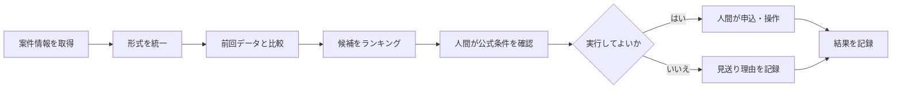

ポイ活を自動化すると聞くと、「放置してポイントを稼げる仕組み」を想像するかもしれません。

しかし、実際に運用して分かったのは、獲得操作まで自動化するBotは、期待できる利益に対してリスクが大きすぎるということです。利用規約への抵触、誤操作、アカウント停止、条件変更の見落としなど、失敗したときの損失が簡単に利益を上回ります。

そこで私たちは、自動化の目的を根本から変更しました。

> ポイントを自動で獲得するのではなく、案件の比較・監視・記録を自動化し、最終判断だけを人間が行う。

この記事では、Hiroの実行履歴90件、誤公開1件、回帰テスト30件成功という内部記録をもとに、ポイ活Botを「危険な獲得Bot」から「安全な意思決定支援ツール」へ作り替えた考え方と実装方法を解説します。

なお、ここで扱う件数は私たちの運用環境における内部記録です。すべてのサービスや運用条件で同じ結果になるとは限りません。また、各サービスの規約や案件条件は変更されるため、実際に利用する際は必ず最新の公式情報を確認してください。

## 最初に結論：自動化すべきなのは「操作」ではなく「判断材料」

ポイ活には、機械が得意な作業と、人間が担当すべき作業があります。

| 作業 | 自動化との相性 | 理由 |
|---|---:|---|
| 案件情報の収集 | 高い | 同じ項目を継続的に取得できる |
| 還元率の比較 | 高い | 数値として機械的に比較できる |
| 条件変更の検知 | 高い | 前回との差分を記録できる |
| 期限の通知 | 高い | 日時を基準に通知できる |
| 実行履歴の保存 | 高い | 漏れなく記録しやすい |
| 申込可否の判断 | 低い | 個人の状況や条件確認が必要 |
| ログイン後の獲得操作 | 低い | 規約、認証、誤操作のリスクがある |
| 投稿・公開 | 低い | 誤公開時の影響範囲が大きい |
| 決済・契約 | 非推奨 | 金銭的・法的な影響が大きい |

重要なのは、技術的に自動化できるかどうかではありません。

判断基準にすべきなのは、次の2点です。

1. 失敗したときに元へ戻せるか  
2. 実行前に人間が内容を確認できるか

情報収集や比較の失敗は、多くの場合、再取得や再計算で修正できます。一方、申込、投稿、購入、契約などは、実行した瞬間に第三者へ影響が及びます。

したがって、ポイ活Botの安全な境界は次の位置にあります。



Botは候補を絞り込み、変化を知らせ、判断材料を残すところまで。不可逆な操作は人間が担当します。

この境界を守るだけでも、誤操作や規約違反のリスクを大きく抑えられます。

## 実行履歴90件で見えた「動く」と「運用できる」の違い

自動化ツールを一度動かすことと、継続して運用することは別問題です。

私たちの内部記録では、Hiroによる実行履歴が90件ありました。その中で特に重要だったのが、正常に動いた回数よりも、「どの処理が、どの条件で、どのように失敗したか」を追跡できる状態にしたことです。

最低限、各実行について次の情報を残します。

```json
{
  "run_id": "一意の実行ID",
  "started_at": "実行開始日時",
  "finished_at": "実行終了日時",
  "source": "取得元",
  "mode": "収集・比較・下書き・公開など",
  "status": "success・warning・failed",
  "items_found": 0,
  "items_changed": 0,
  "approval_required": true,
  "approved_by": null,
  "error_code": null
}
```

この記録がないと、「昨日は動いた」「たぶん取得できた」といった曖昧な会話しかできません。

一方、履歴があれば次の問いに答えられます。

- どの処理が失敗しやすいか
- いつから取得件数が減ったか
- 条件変更の直前に何が起きたか
- 人間の承認を通過した処理か
- 同じエラーが再発していないか
- 公開処理と下書き処理が混同されていないか

90件という数字だけでは、安全性は証明できません。対象サービス、実行条件、期間、失敗の分類がなければ、一般化もできません。

それでも、履歴を残したことで「成功率を感覚で語る状態」から「失敗の傾向を検証できる状態」へ移行できました。ここが自動化を資産化する第一歩でした。

## 誤公開1件から変えた設計

運用中、誤公開が1件発生しました。

1件だけと考えることもできます。しかし、公開処理では件数より影響範囲を見るべきです。誤った内容が外部へ出れば、修正までの時間、閲覧者数、信用低下、削除漏れなどのコストが発生します。

この経験から、公開処理を単なる関数呼び出しとして扱うのをやめ、明確な状態遷移を設けました。

```text
収集済み
  ↓
比較済み
  ↓
下書き作成済み
  ↓
レビュー待ち
  ↓
承認済み
  ↓
公開可能
  ↓
公開済み
```

「下書き作成済み」から「公開済み」へ直接進むことは禁止します。

さらに、次の安全策を追加します。

### 1. 初期値を公開不可にする

設定が欠けた場合に公開される設計は危険です。

```yaml
publish_enabled: false
approval_required: true
dry_run: true
```

公開には明示的な設定変更が必要であり、設定ファイルが読めない場合や値が不正な場合は停止させます。

### 2. 収集権限と公開権限を分離する

情報収集に使うプロセスへ、投稿や公開に必要な権限を渡さないようにします。

収集処理が侵害されたり誤動作したりしても、公開まではできない構成にするためです。

### 3. 承認対象を固定する

人間が確認した下書きと、実際に公開する内容が同一であることを保証します。

たとえば、承認時に本文のハッシュ値を保存します。公開直前に再計算し、値が異なれば停止します。

```text
承認時の本文ハッシュ
        ↓
公開直前に再計算
        ↓
一致 ── 公開可能
不一致 ─ 停止して再承認
```

これにより、承認後に本文が自動更新され、未確認の内容が公開される事故を防げます。

### 4. 公開直前に要約を表示する

承認画面では全文だけでなく、少なくとも次の情報を一覧表示します。

- 公開先
- タイトル
- 本文の文字数
- 外部リンクの件数とリンク先
- 画像の件数
- 前回承認時からの変更点
- 公開予定時刻
- 取り消し方法

「承認」ボタンを置くだけでは不十分です。承認者が短時間で危険箇所を確認できる画面が必要です。

## 回帰テスト30件で守っていること

安全策を実装しても、後から機能を追加した際に壊れる可能性があります。

そこで、公開制御、データ比較、異常時の停止などを対象に回帰テストを用意しました。内部記録では30件が成功しています。

ただし、「30件成功」は安全性そのものを保証する数字ではありません。重要なのは、テストが実際の事故や重要な境界条件を反映しているかどうかです。

優先して確認すべきなのは、正常系より次のような異常系です。

| テスト条件 | 期待する動作 |
|---|---|
| 承認情報がない | 公開しない |
| 承認後に本文が変わった | 公開を停止する |
| 取得件数が突然ゼロになった | 正常終了にせず警告する |
| 還元率を数値へ変換できない | 推測せず確認待ちにする |
| 同一案件を複数回取得した | 重複登録しない |
| 公式ページを取得できない | 前回値で自動判断しない |
| ログ保存に失敗した | 後続処理を停止する |
| 通知に失敗した | 実行結果を失敗として残す |
| 公開先が許可リスト外 | 公開しない |
| テスト用設定で本番を指定 | 起動時に停止する |

事故が起きたら、修正だけで終わらせてはいけません。

1. 原因を再現するテストを追加する  
2. 追加したテストが失敗することを確認する  
3. 修正を実装する  
4. 新旧すべてのテストを実行する  
5. 再発しないことを確認する  

この順序を守ることで、事故を一度限りの反省ではなく、将来の事故を防ぐ仕組みに変えられます。

## 採算性は「獲得額」ではなく「節約できた判断時間」で測る

ポイ活自動化では、Botが獲得したポイントだけを成果にすると判断を誤ります。

比較・監視型のツールでは、次の式のほうが実態に近くなります。

```text
月間価値
= 取りこぼしを防げた金額
+ 比較時間の削減価値
- 開発費
- 保守費
- 誤判定による損失
- アカウントや信用に関するリスク費用
```

たとえば、毎日20分かけて複数サイトを確認しているなら、月30日で10時間です。その作業を2時間まで減らせれば、月8時間を節約できます。

ただし、自動化の保守に毎月6時間かかるなら、実質的な削減は2時間しかありません。

さらに、案件条件を誤認して不要な契約を1件行えば、それまでの利益が消える可能性もあります。したがって、還元額だけでなく、保守時間と失敗コストも記録する必要があります。

おすすめの指標は次の5つです。

- 月間の監視対象件数
- 条件変更を検知した件数
- 人間の確認時間を削減できた時間
- 誤検知と見逃しの件数
- 月間の保守時間

この数字を3か月ほど記録すると、ツールを維持する価値があるか判断しやすくなります。

## 規約とセキュリティで守るべき最低線

技術的にアクセスできることと、実行してよいことは同じではありません。

サービスごとに利用規約、禁止事項、APIの提供状況、アクセス頻度の制限が異なります。規約は変更される可能性があるため、この記事で一律に「ここまでなら安全」と断言することはできません。

少なくとも、次の確認が必要です。

- 公式APIや正規のデータ提供手段があるか
- 自動アクセスやスクレイピングが許可されているか
- ログイン後の操作を自動化してよいか
- 取得した情報を保存・再配布してよいか
- 紹介リンクや広告表示に必要な表記があるか
- 個人情報や認証情報をどこへ保存するか

認証情報をソースコードへ直接書くのも避けます。

```text
悪い例:
API_KEY = "実際の秘密情報"

望ましい例:
API_KEY = 環境変数または秘密情報管理サービスから取得
```

ログにも注意が必要です。エラー調査のためにHTMLや通信内容を丸ごと保存すると、Cookie、氏名、メールアドレス、会員番号などが混入する場合があります。

保存前に機密情報を除去し、ログの保管期間も決めてください。

## 初心者向け：最初の7日間で作るもの

いきなり複数サービスへ対応したBotを作る必要はありません。最初は1サービス、1案件種別、1日1回の監視で十分です。

### 1日目：対象を1つに絞る

監視したい案件を1種類だけ決めます。

最初からログイン、自動申込、自動投稿は扱いません。公開ページまたは公式に提供されたデータだけを対象にします。

### 2日目：保存項目を決める

最低限、次の項目を保存します。

```csv
checked_at,title,reward,deadline,source_url,status
```

取得できない項目を推測で補完してはいけません。空欄または「確認待ち」として扱います。

### 3日目：前回との差分を出す

新着、終了、還元額の変更、期限の変更を検知します。

```text
前回: 5,000ポイント
今回: 8,000ポイント
差分: +3,000ポイント
判定: 要確認
```

変更を検知しても、すぐに「お得」と判断しないことが重要です。適用条件や最低利用額が変わっている可能性があるためです。

### 4日目：異常値を止める

次の場合は通知だけを行い、自動判断を停止します。

- 取得件数が前回の半分未満
- 還元額が極端に増減
- 期限を解析できない
- 同一案件が重複
- 公式ページへ接続できない

### 5日目：通知を追加する

通知には、結論だけでなく根拠を含めます。

```text
案件名: ○○サービス
変更内容: 5,000 → 8,000ポイント
検知日時: YYYY-MM-DD HH:MM
確認先: 公式URL
自動判定: 未実施
次の操作: 公式条件を確認
```

### 6日目：実行履歴を残す

成功時にもログを保存します。失敗時だけ保存すると、正常時との比較ができません。

### 7日目：失敗を再現するテストを書く

取得件数ゼロ、金額の解析失敗、重複データなどを意図的に発生させ、正しく停止するか確認します。

ここまで完成してから、監視対象を1つずつ増やしてください。

## 実運用前のチェックリスト

### データ取得

- [ ] 取得元が明記されている
- [ ] 取得日時を保存している
- [ ] 前回データを上書きせず履歴を残している
- [ ] 取得失敗を「変更なし」と判定しない
- [ ] 不明な値を推測で補完しない

### 判断

- [ ] 還元額以外の条件も確認できる
- [ ] 新規契約や最低利用額を区別している
- [ ] 有効期限を確認できる
- [ ] 公式ページへのリンクがある
- [ ] 最終判断を人間が行う

### セキュリティ

- [ ] パスワードやCookieをコードへ書いていない
- [ ] ログから個人情報を除去している
- [ ] 収集権限と公開権限を分離している
- [ ] 秘密情報の有効期限と更新方法を決めている
- [ ] 不要になった認証情報を無効化できる

### 公開・実行

- [ ] 初期状態では公開できない
- [ ] 人間の承認が必要
- [ ] 承認後の変更を検知できる
- [ ] 実行先を許可リストで制限している
- [ ] 取り消し手順を用意している

## この方法にも限界がある

比較・監視型へ変更しても、リスクがゼロになるわけではありません。

画面構造が変われば取得処理は壊れます。表示された還元率が特定ユーザー限定の場合もあります。取得時点では正しかった情報が、申込時には変更されている可能性もあります。

また、実行履歴90件、誤公開1件、回帰テスト30件成功という記録は、今回の運用範囲に限られた結果です。長期間の安定性、他サービスへの再現性、規約上の適合性を証明するものではありません。

不足している検証として、少なくとも次が残っています。

- より長期間の継続運用
- サービスごとの規約確認
- 取得失敗時の見逃し率測定
- 誤検知率の定量評価
- 認証情報が漏えいした場合の復旧訓練
- 公開取り消し手順の定期テスト

この限界を明示せず、「完全自動で安全」「放置で稼げる」と表現するのは適切ではありません。

## まとめ：優れたポイ活Botは、勝手に動かない

ポイ活自動化で価値があるのは、クリックや申込を代行する機能ではありません。

本当に役立つのは、案件を継続的に監視し、条件の変化を記録し、人間が短時間で判断できる状態を作ることです。

私たちが実行履歴90件と誤公開1件から得た結論は、シンプルです。

> 自動化の完成度は、どれだけ多くの操作を任せられるかではなく、危険な操作をどれだけ確実に止められるかで決まる。

これから始めるなら、まずは1つの案件について「前回との違いを通知するだけ」のツールを作ってください。

申込や公開は自動化せず、取得日時、変更内容、公式URL、確認結果を記録します。1週間運用し、異常時に正しく停止できることを確認したら、次の監視対象を追加します。

「自動で稼ぐBot」を目指す必要はありません。

比較・監視・記録を積み重ね、人間の判断を速く正確にする。そのほうが、安全で、再利用しやすく、長期的には価値のある自動化資産になります。
